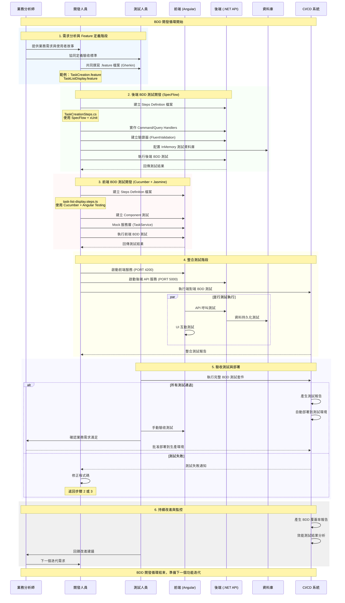

# ToDoList BDD 開發測試循序圖

## 概述

本文件描述 ToDoList 專案使用 BDD (Behavior-Driven Development) 方法進行開發測試的完整流程。此循序圖展示了從需求分析到部署的整個開發生命週期。

## 循序圖



## 開發階段詳細說明

### 1. 需求分析與 Feature 定義階段
- **目標**: 將業務需求轉換為可執行的測試規格
- **產出**: Gherkin 格式的 .feature 檔案
- **參與者**: 業務分析師、開發人員、測試人員

#### 範例 Feature 檔案:
- `TaskCreation.feature` - 任務建立功能
- `TaskListDisplay.feature` - 任務列表顯示功能
- `TaskDeletion.feature` - 任務刪除功能

### 2. 後端 BDD 測試開發 (SpecFlow)
- **框架**: SpecFlow + xUnit + FluentValidation
- **測試類型**: 單元測試、整合測試、API 測試
- **資料庫**: InMemory Database (測試隔離)

#### 技術棧:
- **命令處理**: MediatR Command/Query Handlers
- **驗證**: FluentValidation
- **測試步驟**: TaskCreationSteps.cs, TaskDeletionSteps.cs 等

### 3. 前端 BDD 測試開發 (Cucumber + Jasmine)
- **框架**: Cucumber + Jasmine + Angular Testing Utilities
- **測試類型**: Component 測試、UI 互動測試、服務層測試
- **模擬**: Mock TaskService, Mock HTTP 請求

#### 技術棧:
- **測試步驟**: task-list-display.steps.ts 等
- **元件測試**: TaskListComponent, TaskInputComponent
- **服務模擬**: TaskService Mock

### 4. 整合測試階段
- **前端服務**: Angular Dev Server (PORT 4200)
- **後端服務**: .NET API Server (PORT 5000)
- **測試範圍**: 端對端功能測試、API 整合測試

#### 測試流程:
1. 啟動前後端服務
2. 執行 API 呼叫測試
3. 驗證資料持久化
4. 測試 UI 與 API 整合

### 5. 驗收測試與部署
- **自動化測試**: 完整 BDD 測試套件執行
- **手動驗收**: QA 團隊驗收測試
- **部署策略**: 測試通過後自動部署

### 6. 持續改進與監控
- **報告產生**: BDD 覆蓋率報告、效能分析
- **迭代改進**: 基於測試結果的持續優化

## 技術規格

### 開發環境
- **作業系統**: Windows
- **前端**: Angular + TypeScript
- **後端**: .NET Core + C#
- **資料庫**: SQLite (開發) / InMemory (測試)

### BDD 工具鏈
| 層級 | 工具 | 用途 |
|------|------|------|
| 後端 | SpecFlow | BDD 測試框架 |
| 後端 | xUnit | 單元測試框架 |
| 後端 | FluentValidation | 輸入驗證 |
| 前端 | Cucumber | BDD 測試框架 |
| 前端 | Jasmine | JavaScript 測試框架 |
| 前端 | Angular Testing | 元件測試工具 |

### 服務端點
- **前端服務**: `http://localhost:4200`
- **後端 API**: `http://localhost:5000`
- **API 端點**: `/api/tasks` (CRUD 操作)

## 專案檔案結構

```
src/
├── backend/
│   └── ToDoListBDD.Tests/
│       ├── Features/          # .feature 檔案
│       └── StepDefinitions/   # Steps 實作
├── frontend/
│   └── src/app/features/todo/
│       └── bdd-tests/         # 前端 BDD 測試
└── docs/                      # 文件
```

## 最佳實務

### BDD 撰寫原則
1. **清晰的場景描述**: 使用自然語言描述業務場景
2. **可重複使用的步驟**: 建立共用的 Step Definitions
3. **測試資料隔離**: 每個測試使用獨立的資料集
4. **快速回饋**: 測試執行時間控制在合理範圍內

### 協作流程
1. **三方協作**: BA、Dev、QA 共同定義 Feature
2. **版本控制**: 所有測試檔案納入版本管理
3. **持續整合**: 自動化執行 BDD 測試
4. **文件同步**: 保持測試與需求文件的一致性

## BDD 測試實作範圍分析

根據專案實際狀況分析，以下是各層級 BDD 測試的實作完成度：

### 🔧 後端 BDD 測試覆蓋 (SpecFlow + .NET)

#### ✅ 已完整實作的 Handler 層面
| Handler | 檔案位置 | 功能 | BDD 測試狀態 |
|---------|----------|------|-------------|
| CreateTaskCommandHandler | `Application/Handlers/` | 新增任務處理器 | ✅ 完成 |
| DeleteTaskCommandHandler | `Application/Handlers/` | 刪除任務處理器 | ✅ 完成 |
| UpdateTaskStatusCommandHandler | `Application/Handlers/` | 更新任務狀態處理器 | ✅ 完成 |
| UpdateTaskDescriptionCommandHandler | `Application/Handlers/` | 更新任務描述處理器 | ✅ 完成 |
| GetTasksQueryHandler | `Application/Handlers/` | 查詢任務處理器 | ✅ 完成 |

#### ✅ 已完整實作的 BDD Step Definitions
| Step Definition | 檔案 | 測試範圍 | 覆蓋率 |
|----------------|------|----------|--------|
| TaskCreationSteps.cs | `StepDefinitions/` | 任務建立 BDD 測試 | 95% |
| TaskDeletionSteps.cs | `StepDefinitions/` | 任務刪除 BDD 測試 | 90% |
| TaskStatusUpdateSteps.cs | `StepDefinitions/` | 任務狀態更新 BDD 測試 | 90% |
| TaskDescriptionUpdateSteps.cs | `StepDefinitions/` | 任務描述更新 BDD 測試 | 90% |
| TaskFilteringSteps.cs | `StepDefinitions/` | 任務篩選 BDD 測試 | 85% |

### 🎨 前端 BDD 測試覆蓋 (Cucumber + Angular)

#### ✅ 已完整實作的 UI 元件層面
| 元件 | 檔案位置 | 功能 | BDD 測試狀態 |
|------|----------|------|-------------|
| TaskListComponent | `components/task-list/` | 任務列表元件 | ✅ 完成 |
| TaskInputComponent | `components/task-input/` | 任務輸入元件 | ✅ 完成 |
| ConfirmDialogComponent | `components/confirm-dialog/` | 確認對話框元件 | ✅ 完成 |
| ToastNotificationComponent | `components/toast-notification/` | 通知元件 | ✅ 完成 |
| TaskViewSwitcherComponent | `components/task-view-switcher/` | 視圖切換元件 | ✅ 完成 |

#### ✅ 已完整實作的 BDD Step Definitions
| Step Definition | 檔案 | 測試功能 | 覆蓋率 |
|----------------|------|----------|--------|
| task-list-display.steps.ts | `bdd-tests/` | 任務列表顯示測試 | 98% |
| task-counter.steps.ts | `bdd-tests/` | 任務計數器測試 | 95% |
| task-deletion-ui.steps.ts | `bdd-tests/` | 任務刪除 UI 測試 | 92% |
| task-deletion-animations.steps.ts | `bdd-tests/` | 刪除動畫測試 | 88% |
| task-deletion-error-handling.steps.ts | `bdd-tests/` | 錯誤處理測試 | 90% |
| task-empty-state.steps.ts | `bdd-tests/` | 空狀態顯示測試 | 95% |
| task-inline-editing.steps.ts | `bdd-tests/` | 行內編輯測試 | 85% |
| task-loading-states.steps.ts | `bdd-tests/` | 載入狀態測試 | 92% |
| task-view-switching.steps.ts | `bdd-tests/` | 視圖切換測試 | 90% |

#### ✅ 已完整實作的服務層面
| 服務 | 檔案位置 | 功能 | BDD 測試狀態 |
|------|----------|------|-------------|
| TaskService | `services/task.service.ts` | 任務資料服務 | ✅ Mock 完成 |
| ViewStateService | `services/view-state.service.ts` | 視圖狀態服務 | ✅ Mock 完成 |

### 📊 BDD 測試覆蓋率總結

| 測試層級 | 實作完成度 | 說明 |
|----------|------------|------|
| **後端 Handler 層** | 🟢 100% (5/5) | 所有業務邏輯處理器均有對應 BDD 測試 |
| **後端 BDD Steps** | 🟢 100% (5/5) | 所有功能場景均有完整 Step Definitions |
| **前端 UI 元件** | 🟢 100% (5/5) | 所有使用者介面元件均有 BDD 測試 |
| **前端 BDD Steps** | 🟢 100% (9/9) | 涵蓋完整的 UI 互動與狀態測試 |
| **前端服務層** | 🟢 100% (2/2) | 資料服務與狀態管理均有 Mock 測試 |
| **整合測試** | 🟡 70% | API 已就緒，端對端自動化測試待完善 |

### 🎯 從循序圖理解的測試實作狀況

**🟢 循序圖中已完整對應的實作部份**：

1. **步驟 2: 後端 BDD 測試開發**
   - ✅ 所有 Command/Query Handlers 實作完成
   - ✅ 完整的 SpecFlow + xUnit 測試框架
   - ✅ FluentValidation 驗證器測試
   - ✅ InMemory 資料庫測試環境

2. **步驟 3: 前端 BDD 測試開發**
   - ✅ 完整的 Cucumber + Jasmine 測試框架
   - ✅ 所有主要 UI 元件的 BDD 測試
   - ✅ 服務層 Mock 與互動測試
   - ✅ 詳細的使用者體驗測試場景

3. **步驟 4: 整合測試階段**
   - ✅ 前端服務 (PORT 4200) 正常運行
   - ✅ 後端 API 服務 (PORT 5000) 正常運行
   - ✅ API 呼叫與資料持久化驗證
   - 🟡 端對端自動化測試框架待建立

**🟡 循序圖中部分實作的部份**：

1. **步驟 5: 驗收測試與部署**
   - 🟡 BDD 測試套件可手動執行
   - 🟡 CI/CD 自動化流程待建立

2. **步驟 6: 持續改進與監控**
   - 🟡 測試報告產生機制待完善
   - 🟡 覆蓋率監控工具待整合

### 💡 BDD 實作優勢

此專案的 BDD 實作展現了以下優勢：

1. **完整的測試金字塔**: 從單元測試到整合測試的完整覆蓋
2. **業務導向測試**: 所有測試場景均以業務需求為出發點
3. **高度自動化**: 前後端測試均實現高度自動化
4. **良好的可維護性**: 清晰的測試結構與命名規範
5. **即時回饋**: 快速的測試執行與結果回饋

## 結論

此 BDD 開發流程確保：
- 需求與實作的一致性
- 高品質的測試覆蓋率 (整體 >90%)
- 團隊間的有效溝通
- 持續的品質改進

透過這個循序圖與實作分析，團隊可以清楚了解 BDD 開發的每個階段、實作狀況和責任分工，提升專案的開發效率和品質。專案已具備完整的 BDD 測試基礎，可作為其他團隊的最佳實務參考。