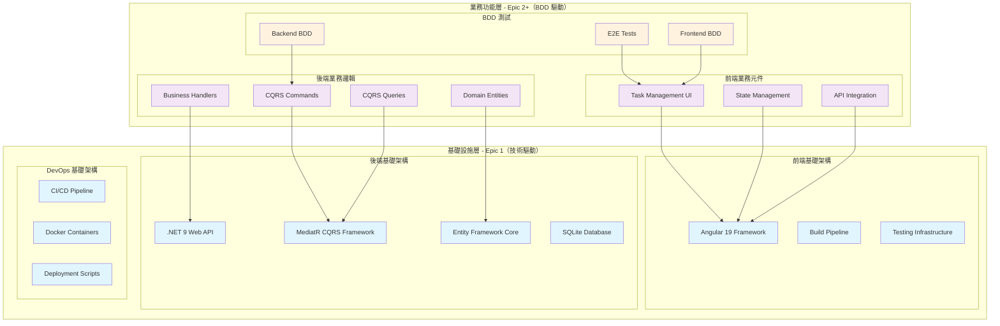
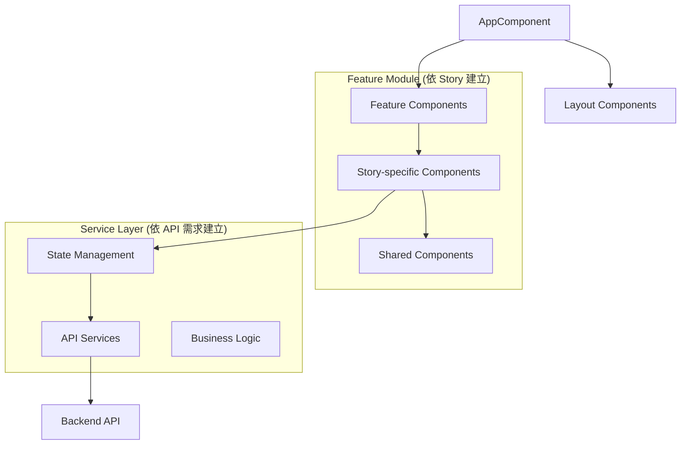
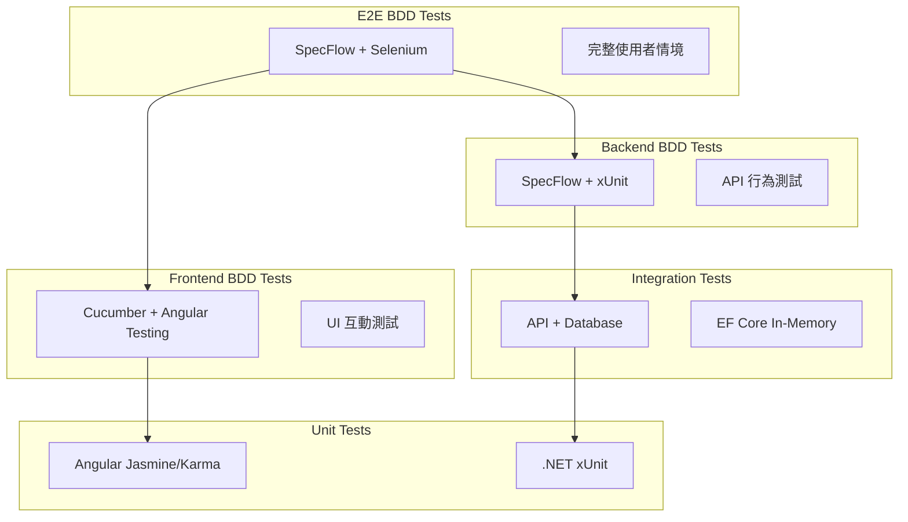

# ToDoListBDD 全端架構設計文件

## 概覽

本文件定義 ToDoListBDD 專案的技術架構，支援雙軌開發流程：基礎設施建立和 BDD 驅動的業務功能開發。

### 架構目標

1. **分層清晰**: 基礎架構層與業務功能層明確分離
2. **技術現代化**: Angular 19 + .NET 9 + CQRS 技術棧
3. **流程支援**: 支援傳統技術驅動和 BDD 驅動兩種開發模式
4. **可維護性**: 清晰的分層架構和責任分離
5. **可測試性**: 完整的測試策略
6. **可擴展性**: 支援漸進式功能擴展

### 架構原則

#### 基礎設施層（Epic 1）
- **驅動方式**: 技術需求驅動
- **設計時機**: 專案初期完整設計
- **變更頻率**: 低，主要在專案初期確定
- **責任範圍**: 技術框架、開發環境、CI/CD、部署架構

#### 業務功能層（Epic 2+）
- **驅動方式**: BDD 場景驅動  
- **設計時機**: Just-in-Time，隨 Story 需求建立
- **變更頻率**: 高，隨業務需求演進
- **責任範圍**: API 設計、資料模型、業務邏輯、用戶介面

## 系統架構總覽

### 分層架構設計



## 前端架構 (Angular 19)

### 架構模式

採用 **功能模組化 + 服務分層** 模式，支援 BDD Story 驅動的漸進式開發：

```
src/frontend/
├── src/
│   ├── app/
│   │   ├── core/                 # 核心模組 (單例服務)
│   │   │   ├── services/         # API 服務、HTTP 攔截器
│   │   │   ├── guards/           # 路由守衛
│   │   │   └── interceptors/     # HTTP 攔截器
│   │   ├── shared/               # 共用模組
│   │   │   ├── components/       # 可重用元件
│   │   │   ├── pipes/            # 管道
│   │   │   └── directives/       # 指令
│   │   ├── features/             # 功能模組 (依 Story 需求動態建立)
│   │   │   └── todo/             # 待辦事項功能 (Epic 1 開始建立)
│   │   │       ├── components/   # Todo 相關元件 (依 Story 需求新增)
│   │   │       ├── services/     # Todo 狀態管理 (依 API 需求建立)
│   │   │       └── models/       # TypeScript 介面 (依 BDD 場景定義)
│   │   └── layout/               # 佈局元件
│   ├── assets/                   # 靜態資源
│   └── environments/             # 環境配置
├── angular.json                  # Angular CLI 配置
├── package.json                  # 相依套件定義
└── tsconfig.json                 # TypeScript 配置
```

### 元件架構指導原則

每個 Story 實作時，會根據 BDD 場景需求建立相應的元件結構：



### 狀態管理策略

採用 **服務 + RxJS + Signals** 模式，在每個 Story 實作時定義具體的狀態結構：

```typescript
// 範例：Story 實作時會建立具體的服務
@Injectable({
  providedIn: 'root'
})
export class FeatureService {
  // 基於 BDD 場景定義的狀態
  // 每個 Story 會根據需求新增相應的 Signal
}
```

### API 整合指導原則

每個 Story 實作時，會根據 BDD 場景定義的 API 需求建立相應的服務：

```typescript
// 範例：Story 實作時會建立 CQRS 對應的 API 服務
@Injectable({
  providedIn: 'root'
})
export class ApiService {
  // Commands 和 Queries 會依據當前 Story 的 BDD 場景需求定義
}
```

## 後端架構 (.NET 9 + MediatR CQRS)

### 專案結構

支援 BDD Story 驅動的漸進式開發：

```
src/backend/
├── ToDoListBDD.API/          # 主要 API 專案
│   ├── Controllers/          # API 控制器 (依 Story API 需求建立)
│   ├── Program.cs            # 應用程式進入點
│   ├── appsettings.json      # 應用程式設定
│   └── ToDoListBDD.API.csproj # 專案檔
├── Application/              # 應用層 (CQRS)
│   ├── Commands/             # 命令及處理器 (依 BDD 場景建立)
│   ├── Queries/              # 查詢及處理器 (依 BDD 場景建立)
│   ├── DTOs/                 # 資料傳輸物件 (依 API 契約建立)
│   ├── Interfaces/           # 應用介面 (依需求定義)
│   └── Application.csproj    # 應用層專案檔
├── Domain/                   # 領域層
│   ├── Entities/             # 實體 (依 BDD 場景的資料需求建立)
│   ├── Enums/                # 列舉 (依業務邏輯需求建立)
│   ├── Exceptions/           # 領域例外 (依驗證需求建立)
│   └── Domain.csproj         # 領域層專案檔
├── Infrastructure/           # 基礎設施層
│   ├── Data/                 # EF Core 配置 (依資料需求建立)
│   ├── Repositories/         # 資料存取 (依 CQRS 需求建立)
│   ├── Services/             # 外部服務 (依整合需求建立)
│   └── Infrastructure.csproj # 基礎設施層專案檔
├── Tests/                    # 測試專案
│   ├── UnitTests/            # 單元測試
│   ├── IntegrationTests/     # 整合測試
│   └── BDDTests/             # BDD 測試 (SpecFlow)
└── ToDoListBDD.sln           # 解決方案檔
```

### CQRS 實作指導原則

每個 Story 實作時，會根據 BDD 場景需求建立相應的 Commands 和 Queries：

#### Commands (寫入操作)

```csharp
// 範例：Story 實作時會根據 BDD 場景建立具體的 Command
public class StorySpecificCommand : IRequest<ResponseType>
{
    // 屬性會依據 BDD 場景的輸入需求定義
}

// Handler 會實作 BDD 場景描述的業務邏輯
public class StorySpecificCommandHandler : IRequestHandler<StorySpecificCommand, ResponseType>
{
    // 依據 BDD 場景的驗證和處理邏輯實作
}
```

#### Queries (讀取操作)

```csharp
// 範例：Story 實作時會根據 BDD 場景建立具體的 Query
public class StorySpecificQuery : IRequest<ResponseType>
{
    // 查詢參數會依據 BDD 場景的篩選需求定義
}

// Handler 會實作 BDD 場景描述的查詢邏輯
public class StorySpecificQueryHandler : IRequestHandler<StorySpecificQuery, ResponseType>
{
    // 依據 BDD 場景的查詢邏輯實作
}
```

### API 控制器指導原則

每個 Story 會根據 BDD 場景定義的 API 行為建立相應的控制器端點：

```csharp
// 範例：Story 實作時會建立對應 BDD 場景的 API 端點
[ApiController]
[Route("api/[controller]")]
public class FeatureController : ControllerBase
{
    private readonly IMediator _mediator;

    public FeatureController(IMediator mediator)
    {
        _mediator = mediator;
    }

    // 端點會依據 BDD 場景的 API 需求定義
    // HTTP 方法、路徑、參數都基於 BDD 場景描述
}
```

## 資料層架構 (Entity Framework Core + SQLite)

### 實體設計指導原則

每個 Story 實作時，會根據 BDD 場景的資料需求建立相應的實體：

```csharp
// 範例：Story 實作時會根據 BDD 場景定義具體的實體結構
public class DomainEntity
{
    // 屬性會依據 BDD 場景的資料需求定義
    // 業務方法會依據 BDD 場景的行為描述實作
}
```

### DbContext 配置策略

支援漸進式的資料模型演進：

```csharp
public class AppDbContext : DbContext
{
    public AppDbContext(DbContextOptions<AppDbContext> options) : base(options) { }

    // DbSet 會依據 Story 需求逐步新增
    // public DbSet<EntityType> EntityName { get; set; }

    protected override void OnModelCreating(ModelBuilder modelBuilder)
    {
        // 實體配置會依據 Story 的資料需求建立
        // modelBuilder.ApplyConfigurationsFromAssembly(typeof(AppDbContext).Assembly);
        
        base.OnModelCreating(modelBuilder);
    }
}
```

### Repository 模式指導原則

每個 Story 會根據 CQRS Commands/Queries 的需求定義相應的資料存取方法：

```csharp
// 範例：Story 實作時會根據 CQRS 需求定義具體的 Repository 介面
public interface IFeatureRepository
{
    // 方法會依據 Story 的 Commands 和 Queries 需求定義
}

// 實作會依據 BDD 場景的資料存取邏輯建立
public class FeatureRepository : IFeatureRepository
{
    private readonly AppDbContext _context;

    public FeatureRepository(AppDbContext context)
    {
        _context = context;
    }

    // 具體方法會依據 Story 需求實作
}
```

## BDD 測試架構整合

### 測試層級架構



### BDD 場景到測試的映射

#### Frontend BDD (Cucumber + Angular)

```typescript
// features/task-management.feature
Feature: 任務管理
  As a 生產力使用者
  I want to 管理我的待辦任務
  So that 我可以提高工作效率

  Scenario: 成功新增待辦任務
    Given 我在待辦清單主頁面
    And 任務輸入框是空的
    When 我在輸入框中輸入 "完成專案報告"
    And 我按下 Enter 鍵
    Then 我應該看到新任務 "完成專案報告" 出現在待辦任務列表中

// step_definitions/task-management.steps.ts
import { Given, When, Then } from '@cucumber/cucumber';
import { ComponentFixture, TestBed } from '@angular/core/testing';

let component: TodoListComponent;
let fixture: ComponentFixture<TodoListComponent>;

Given('我在待辦清單主頁面', async function () {
  await TestBed.configureTestingModule({
    declarations: [TodoListComponent],
    imports: [HttpClientTestingModule]
  }).compileComponents();
  
  fixture = TestBed.createComponent(TodoListComponent);
  component = fixture.componentInstance;
  fixture.detectChanges();
});

When('我在輸入框中輸入 {string}', function (taskDescription: string) {
  const inputElement = fixture.debugElement.query(By.css('input[data-testid="task-input"]'));
  inputElement.nativeElement.value = taskDescription;
  inputElement.nativeElement.dispatchEvent(new Event('input'));
});

Then('我應該看到新任務 {string} 出現在待辦任務列表中', function (taskDescription: string) {
  const taskElements = fixture.debugElement.queryAll(By.css('[data-testid="task-item"]'));
  const taskTexts = taskElements.map(el => el.nativeElement.textContent);
  expect(taskTexts).toContain(taskDescription);
});
```

#### Backend BDD (SpecFlow + .NET)

```csharp
// Features/TaskManagement.feature
Feature: 任務管理 API
    為了管理待辦任務
    作為前端應用
    我需要一個可靠的任務管理 API

Scenario: 成功建立新任務
    Given 系統中沒有任務
    When 我發送建立任務請求 "完成專案報告"
    Then 應該返回狀態碼 201
    And 回應應該包含任務 ID
    And 任務描述應該是 "完成專案報告"

// StepDefinitions/TaskManagementSteps.cs
[Binding]
public class TaskManagementSteps
{
    private readonly TestContext _context;
    private HttpResponseMessage _response;

    public TaskManagementSteps(TestContext context)
    {
        _context = context;
    }

    [Given(@"系統中沒有任務")]
    public async Task GivenSystemHasNoTasks()
    {
        await _context.Database.EnsureDeletedAsync();
        await _context.Database.EnsureCreatedAsync();
    }

    [When(@"我發送建立任務請求 ""(.*)""")]
    public async Task WhenISendCreateTaskRequest(string description)
    {
        var command = new CreateTaskCommand { Description = description };
        var json = JsonSerializer.Serialize(command);
        var content = new StringContent(json, Encoding.UTF8, "application/json");
        
        _response = await _context.Client.PostAsync("/api/tasks", content);
    }

    [Then(@"應該返回狀態碼 (\d+)")]
    public void ThenShouldReturnStatusCode(int statusCode)
    {
        Assert.Equal(statusCode, (int)_response.StatusCode);
    }
}
```

## 部署和 DevOps

### 開發環境配置

```dockerfile
# src/frontend/Dockerfile
FROM node:20-alpine as build
WORKDIR /app
COPY package*.json ./
RUN npm ci
COPY . .
RUN npm run build

FROM nginx:alpine
COPY --from=build /app/dist /usr/share/nginx/html
COPY nginx.conf /etc/nginx/nginx.conf
EXPOSE 4200

# src/backend/Dockerfile
FROM mcr.microsoft.com/dotnet/sdk:9.0 AS build
WORKDIR /src
COPY ["ToDoListBDD.API/ToDoListBDD.API.csproj", "ToDoListBDD.API/"]
COPY ["Application/Application.csproj", "Application/"]
COPY ["Domain/Domain.csproj", "Domain/"]
COPY ["Infrastructure/Infrastructure.csproj", "Infrastructure/"]
RUN dotnet restore "ToDoListBDD.API/ToDoListBDD.API.csproj"
COPY . .
RUN dotnet build "ToDoListBDD.API/ToDoListBDD.API.csproj" -c Release -o /app/build

FROM build AS publish
RUN dotnet publish "ToDoListBDD.API/ToDoListBDD.API.csproj" -c Release -o /app/publish

FROM mcr.microsoft.com/dotnet/aspnet:9.0 AS final
WORKDIR /app
COPY --from=publish /app/publish .
EXPOSE 5000
ENTRYPOINT ["dotnet", "ToDoListBDD.API.dll"]
```

### Docker Compose 設置

```yaml
# docker-compose.yml
version: '3.8'

services:
  frontend:
    build:
      context: ./src/frontend
      dockerfile: Dockerfile
    ports:
      - "4200:4200"
    depends_on:
      - backend
    environment:
      - API_URL=http://backend:5000

  backend:
    build:
      context: ./src/backend
      dockerfile: Dockerfile
    ports:
      - "5000:5000"
    environment:
      - ASPNETCORE_ENVIRONMENT=Development
      - ConnectionStrings__DefaultConnection=Data Source=/app/data/todolist.db
    volumes:
      - ./data:/app/data

  bdd-tests:
    build:
      context: ./tests
      dockerfile: Dockerfile.bdd
    depends_on:
      - frontend
      - backend
    environment:
      - BASE_URL=http://frontend
      - API_URL=http://backend:5000
    volumes:
      - ./test-results:/app/results
```

## 安全性考量

### API 安全

1. **CORS 配置**: 限制允許的來源
2. **速率限制**: 防止 API 濫用
3. **輸入驗證**: 所有 Commands 都有驗證
4. **錯誤處理**: 避免敏感資訊洩露

```csharp
// Startup.cs 安全配置
public void ConfigureServices(IServiceCollection services)
{
    services.AddCors(options =>
    {
        options.AddPolicy("DevelopmentPolicy", builder =>
        {
            builder.WithOrigins("http://localhost:4200")
                   .AllowAnyMethod()
                   .AllowAnyHeader();
        });
    });

    services.AddRateLimiter(options =>
    {
        options.GlobalLimiter = PartitionedRateLimiter.Create<HttpContext, string>(context =>
            RateLimitPartition.GetFixedWindowLimiter(
                partitionKey: context.Request.Headers.Host.ToString(),
                factory: partition => new FixedWindowRateLimiterOptions
                {
                    AutoReplenishment = true,
                    PermitLimit = 100,
                    Window = TimeSpan.FromMinutes(1)
                }));
    });
}
```

### 資料安全

1. **SQLite 檔案保護**: 適當的檔案權限
2. **連接字串加密**: 生產環境中加密敏感配置
3. **資料驗證**: 防止 SQL 注入（EF Core 自動保護）

## 效能優化

### 前端優化

1. **OnPush 變更檢測**: 提高 Angular 效能
2. **懶載入**: 非必要模組延遲載入
3. **TrackBy 函數**: 優化 ngFor 效能
4. **Service Worker**: 快取靜態資源

### 後端優化

1. **查詢優化**: 適當的資料庫索引
2. **連接池**: EF Core 連接池配置
3. **回應快取**: 讀取查詢的快取機制
4. **壓縮**: Gzip 回應壓縮

## 監控和日誌

### 應用程式監控

```csharp
// 結構化日誌配置
public void ConfigureServices(IServiceCollection services)
{
    services.AddLogging(builder =>
    {
        builder.AddConsole();
        builder.AddDebug();
        builder.AddApplicationInsights(); // 如使用 Azure
    });

    services.AddHealthChecks()
            .AddDbContextCheck<TodoDbContext>();
}

// 自訂中介軟體記錄請求
public class RequestLoggingMiddleware
{
    private readonly RequestDelegate _next;
    private readonly ILogger<RequestLoggingMiddleware> _logger;

    public RequestLoggingMiddleware(RequestDelegate next, ILogger<RequestLoggingMiddleware> logger)
    {
        _next = next;
        _logger = logger;
    }

    public async Task InvokeAsync(HttpContext context)
    {
        var stopwatch = Stopwatch.StartNew();
        await _next(context);
        stopwatch.Stop();

        _logger.LogInformation("Request {Method} {Path} completed in {ElapsedMilliseconds}ms with status {StatusCode}",
            context.Request.Method,
            context.Request.Path,
            stopwatch.ElapsedMilliseconds,
            context.Response.StatusCode);
    }
}
```

## 總結

此架構設計確保了：

1. **BDD 驅動開發**: 所有層級都支援 BDD 測試和場景驗證
2. **現代化實踐**: Angular 19 + .NET 9 + CQRS 的企業級模式
3. **可維護性**: 清晰的分層架構和責任分離
4. **可測試性**: 完整的測試金字塔覆蓋
5. **可擴展性**: CQRS 模式支援未來功能擴展
6. **效能**: 優化的查詢、快取和資源管理
7. **安全性**: 企業級安全考量和最佳實踐

下一步將基於此架構開始實作 Epic 1 的 BDD 測試基礎建立。