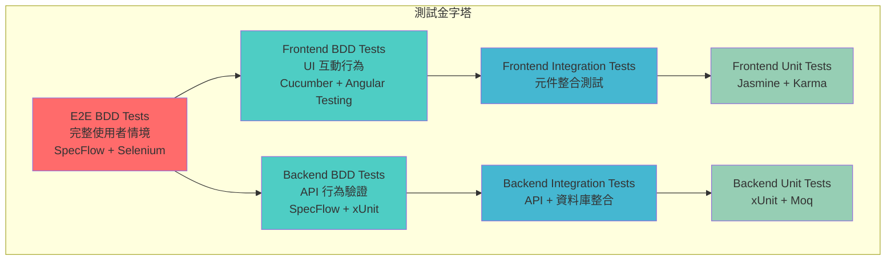

# ToDoListBDD 測試策略與 BDD 整合架構

## 概覽

本文件定義完整的 BDD 測試架構策略，涵蓋前端、後端和端到端測試，確保 BDD 文件驅動所有測試活動。

## BDD 測試金字塔架構



## 測試環境配置

### 測試專案結構

```
tests/
├── ToDoListBDD.E2E.Tests/              # E2E BDD 測試
│   ├── Features/                       # Gherkin 特性檔案
│   ├── StepDefinitions/                # 步驟定義
│   ├── Drivers/                        # Selenium WebDriver 配置
│   ├── PageObjects/                    # 頁面物件模式
│   └── Support/                        # 測試支援類別
├── ToDoListBDD.Frontend.BDD.Tests/     # 前端 BDD 測試
│   ├── features/                       # Cucumber 特性檔案
│   ├── step_definitions/               # 步驟定義
│   ├── support/                        # 測試配置
│   └── pages/                          # 頁面物件
├── ToDoListBDD.Backend.BDD.Tests/      # 後端 BDD 測試
│   ├── Features/                       # SpecFlow 特性檔案
│   ├── StepDefinitions/                # 步驟定義
│   ├── Infrastructure/                 # 測試基礎設施
│   └── TestData/                       # 測試資料
├── ToDoListBDD.Integration.Tests/      # 整合測試
└── ToDoListBDD.Unit.Tests/            # 單元測試
```

## E2E BDD 測試 (SpecFlow + Selenium)

### 專案配置

```xml
<!-- ToDoListBDD.E2E.Tests.csproj -->
<Project Sdk="Microsoft.NET.Sdk">
  <PropertyGroup>
    <TargetFramework>net9.0</TargetFramework>
    <IsPackable>false</IsPackable>
  </PropertyGroup>

  <ItemGroup>
    <PackageReference Include="SpecFlow" Version="3.9.74" />
    <PackageReference Include="SpecFlow.xUnit" Version="3.9.74" />
    <PackageReference Include="SpecFlow.Tools.MsBuild.Generation" Version="3.9.74" />
    <PackageReference Include="Selenium.WebDriver" Version="4.15.0" />
    <PackageReference Include="Selenium.WebDriver.ChromeDriver" Version="118.0.5993.7000" />
    <PackageReference Include="Selenium.Support" Version="4.15.0" />
    <PackageReference Include="Microsoft.Extensions.Configuration" Version="8.0.0" />
    <PackageReference Include="Microsoft.Extensions.Configuration.Json" Version="8.0.0" />
    <PackageReference Include="xunit" Version="2.4.2" />
    <PackageReference Include="xunit.runner.visualstudio" Version="2.4.5" />
  </ItemGroup>

  <ItemGroup>
    <None Update="appsettings.json">
      <CopyToOutputDirectory>PreserveNewest</CopyToOutputDirectory>
    </None>
  </ItemGroup>
</Project>
```

### E2E 特性檔案

```gherkin
# Features/TodoManagement.feature
@e2e
Feature: 端到端待辦清單管理
    作為使用者
    我想要完整地管理我的待辦清單
    以便提高我的生產力

Background:
    Given 我開啟待辦清單應用程式
    And 應用程式已完全載入

@smoke
Scenario: 完整的任務管理流程
    Given 待辦清單是空的
    When 我新增任務 "準備會議資料"
    And 我新增任務 "完成專案報告"
    And 我新增任務 "回覆客戶郵件"
    Then 我應該看到 3 個待辦任務
    And 任務計數應該顯示 "3 個待辦任務"

    When 我標記 "準備會議資料" 為已完成
    Then 我應該看到 2 個待辦任務
    And 我應該看到 1 個已完成任務
    And 任務計數應該顯示 "2 個待辦任務, 1 個已完成"

    When 我編輯任務 "完成專案報告" 為 "完成季度專案報告"
    Then 我應該看到任務 "完成季度專案報告"
    And 我不應該看到任務 "完成專案報告"

    When 我刪除任務 "回覆客戶郵件"
    Then 我應該看到 1 個待辦任務
    And 我不應該看到任務 "回覆客戶郵件"

    When 我點擊 "清除已完成" 按鈕
    And 我確認清除操作
    Then 我應該看到 1 個待辦任務
    And 我應該看到 0 個已完成任務

@filter
Scenario: 任務檢視切換和搜尋
    Given 我有以下任務：
        | 任務描述        | 狀態  |
        | 開發新功能      | 待辦  |
        | 測試功能        | 待辦  |
        | 部署到生產環境   | 已完成 |
        | 撰寫文件        | 已完成 |
    
    When 我點擊 "已完成" 檢視
    Then 我應該只看到已完成任務
    And 我應該看到 2 個任務
    And 我應該看到任務 "部署到生產環境"
    And 我應該看到任務 "撰寫文件"

    When 我點擊 "全部" 檢視
    Then 我應該看到所有任務
    And 我應該看到 4 個任務

    When 我在搜尋框輸入 "功能"
    Then 我應該看到 2 個任務
    And 我應該看到任務 "開發新功能"
    And 我應該看到任務 "測試功能"

@keyboard
Scenario: 鍵盤快捷鍵操作
    Given 我在待辦清單頁面
    When 我按下 Ctrl+N
    Then 任務輸入框應該獲得焦點

    When 我輸入 "快捷鍵測試任務" 並按 Enter
    Then 我應該看到任務 "快捷鍵測試任務"
    And 輸入框應該被清空

    When 我選擇任務 "快捷鍵測試任務"
    And 我按下空白鍵
    Then 任務應該標記為已完成

@error-handling
Scenario: 網路錯誤處理
    Given 我在待辦清單頁面
    When 後端服務停止運作
    And 我嘗試新增任務 "測試錯誤處理"
    Then 我應該看到錯誤訊息 "暫時無法連接到服務器，請稍後再試"
    And 任務不應該被新增到列表中
    
    When 後端服務恢復運作
    And 我重新整理頁面
    Then 我應該能夠正常新增任務
```

### E2E 步驟定義

```csharp
// StepDefinitions/TodoManagementSteps.cs
using OpenQA.Selenium;
using OpenQA.Selenium.Chrome;
using OpenQA.Selenium.Support.UI;
using TechTalk.SpecFlow;
using Xunit;

[Binding]
public class TodoManagementSteps : IDisposable
{
    private readonly IWebDriver _driver;
    private readonly WebDriverWait _wait;
    private readonly string _baseUrl;
    private readonly TodoPage _todoPage;

    public TodoManagementSteps()
    {
        var options = new ChromeOptions();
        options.AddArguments("--headless", "--no-sandbox", "--disable-dev-shm-usage");
        
        _driver = new ChromeDriver(options);
        _wait = new WebDriverWait(_driver, TimeSpan.FromSeconds(10));
        _baseUrl = TestConfiguration.GetBaseUrl();
        _todoPage = new TodoPage(_driver, _wait);
    }

    [Given(@"我開啟待辦清單應用程式")]
    public void GivenIOpenTodoApp()
    {
        _driver.Navigate().GoToUrl(_baseUrl);
    }

    [Given(@"應用程式已完全載入")]
    public void GivenAppIsFullyLoaded()
    {
        _wait.Until(d => _todoPage.IsPageLoaded());
    }

    [Given(@"待辦清單是空的")]
    public async Task GivenTodoListIsEmpty()
    {
        await _todoPage.ClearAllTasks();
        Assert.Equal(0, _todoPage.GetTaskCount());
    }

    [When(@"我新增任務 ""(.*)""")]
    public void WhenIAddTask(string taskDescription)
    {
        _todoPage.AddTask(taskDescription);
    }

    [Then(@"我應該看到 (\d+) 個待辦任務")]
    public void ThenIShouldSeeTodoTasks(int expectedCount)
    {
        Assert.Equal(expectedCount, _todoPage.GetTodoTaskCount());
    }

    [Then(@"任務計數應該顯示 ""(.*)""")]
    public void ThenTaskCountShouldShow(string expectedText)
    {
        Assert.Equal(expectedText, _todoPage.GetTaskCountText());
    }

    [When(@"我標記 ""(.*)"" 為已完成")]
    public void WhenIMarkTaskAsCompleted(string taskDescription)
    {
        _todoPage.MarkTaskAsCompleted(taskDescription);
    }

    [When(@"我編輯任務 ""(.*)"" 為 ""(.*)""")]
    public void WhenIEditTask(string oldDescription, string newDescription)
    {
        _todoPage.EditTask(oldDescription, newDescription);
    }

    [When(@"我刪除任務 ""(.*)""")]
    public void WhenIDeleteTask(string taskDescription)
    {
        _todoPage.DeleteTask(taskDescription);
    }

    [When(@"我點擊 ""清除已完成"" 按鈕")]
    public void WhenIClickClearCompleted()
    {
        _todoPage.ClickClearCompleted();
    }

    [When(@"我確認清除操作")]
    public void WhenIConfirmClearOperation()
    {
        _todoPage.ConfirmDialog();
    }

    [Given(@"我有以下任務：")]
    public void GivenIHaveFollowingTasks(Table table)
    {
        foreach (var row in table.Rows)
        {
            var description = row["任務描述"];
            var status = row["狀態"];
            
            _todoPage.AddTask(description);
            
            if (status == "已完成")
            {
                _todoPage.MarkTaskAsCompleted(description);
            }
        }
    }

    [When(@"我在搜尋框輸入 ""(.*)""")]
    public void WhenISearchFor(string searchTerm)
    {
        _todoPage.SearchTasks(searchTerm);
    }

    [When(@"我按下 Ctrl\+N")]
    public void WhenIPressCtrlN()
    {
        _todoPage.PressKeyboardShortcut(Keys.Control + "n");
    }

    [Then(@"任務輸入框應該獲得焦點")]
    public void ThenInputShouldHaveFocus()
    {
        Assert.True(_todoPage.IsInputFocused());
    }

    public void Dispose()
    {
        _driver?.Quit();
        _driver?.Dispose();
    }
}
```

### 頁面物件模式

```csharp
// PageObjects/TodoPage.cs
using OpenQA.Selenium;
using OpenQA.Selenium.Support.UI;
using OpenQA.Selenium.Interactions;

public class TodoPage
{
    private readonly IWebDriver _driver;
    private readonly WebDriverWait _wait;

    // 元素選擇器
    private static readonly By TaskInputSelector = By.CssSelector("[data-testid='task-input']");
    private static readonly By AddButtonSelector = By.CssSelector("[data-testid='add-button']");
    private static readonly By TaskItemSelector = By.CssSelector("[data-testid='task-item']");
    private static readonly By TaskCheckboxSelector = By.CssSelector("[data-testid='task-checkbox']");
    private static readonly By TaskTextSelector = By.CssSelector("[data-testid='task-text']");
    private static readonly By DeleteButtonSelector = By.CssSelector("[data-testid='delete-button']");
    private static readonly By TaskCountSelector = By.CssSelector("[data-testid='task-count']");
    private static readonly By SearchInputSelector = By.CssSelector("[data-testid='search-input']");
    private static readonly By ClearCompletedSelector = By.CssSelector("[data-testid='clear-completed']");
    private static readonly By ConfirmDialogSelector = By.CssSelector("[data-testid='confirm-dialog']");
    private static readonly By ConfirmButtonSelector = By.CssSelector("[data-testid='confirm-button']");

    public TodoPage(IWebDriver driver, WebDriverWait wait)
    {
        _driver = driver;
        _wait = wait;
    }

    public bool IsPageLoaded()
    {
        try
        {
            _wait.Until(d => d.FindElement(TaskInputSelector));
            return true;
        }
        catch (WebDriverTimeoutException)
        {
            return false;
        }
    }

    public void AddTask(string description)
    {
        var input = _driver.FindElement(TaskInputSelector);
        input.Clear();
        input.SendKeys(description);
        input.SendKeys(Keys.Enter);
        
        // 等待任務新增完成
        _wait.Until(d => GetTaskCount() > 0 || GetTaskItems().Any(t => t.Text.Contains(description)));
    }

    public void MarkTaskAsCompleted(string taskDescription)
    {
        var taskItem = FindTaskByDescription(taskDescription);
        var checkbox = taskItem.FindElement(TaskCheckboxSelector);
        checkbox.Click();
        
        // 等待狀態更新
        Thread.Sleep(500);
    }

    public void EditTask(string oldDescription, string newDescription)
    {
        var taskItem = FindTaskByDescription(oldDescription);
        var taskText = taskItem.FindElement(TaskTextSelector);
        
        // 雙擊進入編輯模式
        var actions = new Actions(_driver);
        actions.DoubleClick(taskText).Perform();
        
        // 等待編輯模式啟動
        _wait.Until(d => taskItem.FindElement(By.CssSelector("input")).Displayed);
        
        var editInput = taskItem.FindElement(By.CssSelector("input"));
        editInput.Clear();
        editInput.SendKeys(newDescription);
        editInput.SendKeys(Keys.Enter);
        
        // 等待編輯完成
        _wait.Until(d => taskText.Text.Contains(newDescription));
    }

    public void DeleteTask(string taskDescription)
    {
        var taskItem = FindTaskByDescription(taskDescription);
        
        // 滑鼠懸停顯示刪除按鈕
        var actions = new Actions(_driver);
        actions.MoveToElement(taskItem).Perform();
        
        var deleteButton = _wait.Until(d => taskItem.FindElement(DeleteButtonSelector));
        deleteButton.Click();
        
        // 確認刪除
        ConfirmDialog();
        
        // 等待任務從列表中移除
        _wait.Until(d => !GetTaskItems().Any(t => t.Text.Contains(taskDescription)));
    }

    public void ClickClearCompleted()
    {
        var clearButton = _driver.FindElement(ClearCompletedSelector);
        clearButton.Click();
    }

    public void ConfirmDialog()
    {
        var confirmButton = _wait.Until(d => d.FindElement(ConfirmButtonSelector));
        confirmButton.Click();
    }

    public void SearchTasks(string searchTerm)
    {
        var searchInput = _driver.FindElement(SearchInputSelector);
        searchInput.Clear();
        searchInput.SendKeys(searchTerm);
        
        // 等待搜尋結果
        Thread.Sleep(500);
    }

    public void PressKeyboardShortcut(string keys)
    {
        var actions = new Actions(_driver);
        actions.SendKeys(keys).Perform();
    }

    public bool IsInputFocused()
    {
        var activeElement = _driver.SwitchTo().ActiveElement();
        var input = _driver.FindElement(TaskInputSelector);
        return activeElement.Equals(input);
    }

    public int GetTaskCount()
    {
        return GetTaskItems().Count;
    }

    public int GetTodoTaskCount()
    {
        return GetTaskItems().Count(t => !t.FindElement(TaskCheckboxSelector).Selected);
    }

    public int GetCompletedTaskCount()
    {
        return GetTaskItems().Count(t => t.FindElement(TaskCheckboxSelector).Selected);
    }

    public string GetTaskCountText()
    {
        return _driver.FindElement(TaskCountSelector).Text;
    }

    public async Task ClearAllTasks()
    {
        // 實作清除所有任務的邏輯
        var tasks = GetTaskItems();
        foreach (var task in tasks.ToList())
        {
            var description = task.FindElement(TaskTextSelector).Text;
            DeleteTask(description);
        }
    }

    private IWebElement FindTaskByDescription(string description)
    {
        return _wait.Until(d => GetTaskItems().FirstOrDefault(t => 
            t.FindElement(TaskTextSelector).Text.Contains(description))) 
            ?? throw new NotFoundException($"找不到任務: {description}");
    }

    private IList<IWebElement> GetTaskItems()
    {
        try
        {
            return _driver.FindElements(TaskItemSelector);
        }
        catch (NoSuchElementException)
        {
            return new List<IWebElement>();
        }
    }
}
```

## 前端 BDD 測試 (Cucumber + Angular)

### 專案配置

```json
// package.json (Frontend BDD Tests)
{
  "name": "todolist-frontend-bdd-tests",
  "version": "1.0.0",
  "scripts": {
    "test:bdd": "cucumber-js",
    "test:bdd:watch": "cucumber-js --watch",
    "test:bdd:report": "cucumber-js --format html:reports/cucumber-report.html"
  },
  "devDependencies": {
    "@cucumber/cucumber": "^10.0.0",
    "@angular/testing": "^19.0.0",
    "jasmine": "^5.0.0",
    "karma": "^6.4.0",
    "karma-chrome-launcher": "^3.2.0",
    "karma-coverage": "^2.2.0",
    "karma-jasmine": "^5.1.0",
    "karma-jasmine-html-reporter": "^2.1.0"
  }
}
```

### Cucumber 配置

```javascript
// cucumber.js
module.exports = {
  default: {
    require: [
      'tests/frontend-bdd/step_definitions/**/*.js',
      'tests/frontend-bdd/support/**/*.js'
    ],
    format: [
      'progress-bar',
      'html:reports/cucumber-report.html',
      'json:reports/cucumber-report.json'
    ],
    formatOptions: {
      snippetInterface: 'async-await'
    }
  }
};
```

### 前端 BDD 特性檔案

```gherkin
# features/task-management.feature
Feature: 前端任務管理互動
  As a 使用者
  I want to 透過前端介面管理任務
  So that 我可以高效地組織我的工作

  Background:
    Given 我在任務管理頁面
    And 頁面已完全載入

  Scenario: 即時任務新增和 UI 回應
    Given 任務輸入框是空的
    When 我在輸入框中輸入 "測試任務"
    And 我按下 Enter 鍵
    Then 任務應該立即出現在列表中
    And 輸入框應該被清空
    And 應該顯示載入指示器 0.5 秒內消失
    And 任務計數應該更新

  Scenario: 任務狀態切換的視覺回饋
    Given 我有一個待辦任務 "測試任務"
    When 我點擊任務的勾選框
    Then 任務應該顯示劃線效果
    And 任務應該移動到已完成區域
    And 應該播放完成動畫
    And 任務計數應該更新

  Scenario: 內聯編輯功能
    Given 我有一個任務 "原始任務描述"
    When 我雙擊任務文字
    Then 應該顯示內聯編輯輸入框
    And 輸入框應該包含原始文字
    And 輸入框應該獲得焦點

    When 我修改文字為 "更新的任務描述"
    And 我按下 Enter 鍵
    Then 編輯模式應該結束
    And 任務文字應該更新為 "更新的任務描述"

  Scenario: 錯誤處理和用戶反饋
    Given API 服務回應錯誤
    When 我嘗試新增任務 "錯誤測試"
    Then 應該顯示錯誤提示訊息
    And 任務不應該新增到列表
    And 輸入框應該保留輸入的文字
    And 應該顯示重試按鈕
```

### 前端 BDD 步驟定義

```typescript
// step_definitions/task-management.steps.ts
import { Given, When, Then } from '@cucumber/cucumber';
import { ComponentFixture, TestBed } from '@angular/core/testing';
import { DebugElement } from '@angular/core';
import { By } from '@angular/platform-browser';
import { HttpClientTestingModule, HttpTestingController } from '@angular/common/http/testing';
import { of, throwError } from 'rxjs';

import { TodoListComponent } from '../../src/app/features/todo/components/todo-list/todo-list.component';
import { TaskService } from '../../src/app/features/todo/services/task.service';

let component: TodoListComponent;
let fixture: ComponentFixture<TodoListComponent>;
let httpMock: HttpTestingController;
let taskService: TaskService;

Given('我在任務管理頁面', async function () {
  await TestBed.configureTestingModule({
    declarations: [TodoListComponent],
    imports: [HttpClientTestingModule],
    providers: [TaskService]
  }).compileComponents();

  fixture = TestBed.createComponent(TodoListComponent);
  component = fixture.componentInstance;
  httpMock = TestBed.inject(HttpTestingController);
  taskService = TestBed.inject(TaskService);
  
  fixture.detectChanges();
});

Given('頁面已完全載入', function () {
  // 模擬 API 回應
  const req = httpMock.expectOne('/api/tasks');
  req.flush([]);
  fixture.detectChanges();
});

Given('任務輸入框是空的', function () {
  const inputElement = fixture.debugElement.query(By.css('[data-testid="task-input"]'));
  inputElement.nativeElement.value = '';
  inputElement.nativeElement.dispatchEvent(new Event('input'));
  fixture.detectChanges();
});

When('我在輸入框中輸入 {string}', function (taskDescription: string) {
  const inputElement = fixture.debugElement.query(By.css('[data-testid="task-input"]'));
  inputElement.nativeElement.value = taskDescription;
  inputElement.nativeElement.dispatchEvent(new Event('input'));
  fixture.detectChanges();
});

When('我按下 Enter 鍵', function () {
  const inputElement = fixture.debugElement.query(By.css('[data-testid="task-input"]'));
  const enterEvent = new KeyboardEvent('keydown', { key: 'Enter' });
  inputElement.nativeElement.dispatchEvent(enterEvent);
  
  // 模擬 API 回應
  const req = httpMock.expectOne({ method: 'POST', url: '/api/tasks' });
  req.flush({ 
    id: 1, 
    description: inputElement.nativeElement.value, 
    isCompleted: false,
    createdAt: new Date().toISOString(),
    updatedAt: new Date().toISOString()
  });
  
  fixture.detectChanges();
});

Then('任務應該立即出現在列表中', function () {
  const taskElements = fixture.debugElement.queryAll(By.css('[data-testid="task-item"]'));
  expect(taskElements.length).toBeGreaterThan(0);
});

Then('輸入框應該被清空', function () {
  const inputElement = fixture.debugElement.query(By.css('[data-testid="task-input"]'));
  expect(inputElement.nativeElement.value).toBe('');
});

Then('應該顯示載入指示器 {float} 秒內消失', async function (seconds: number) {
  const loadingIndicator = fixture.debugElement.query(By.css('[data-testid="loading-indicator"]'));
  expect(loadingIndicator).toBeTruthy();
  
  // 等待指定時間
  await new Promise(resolve => setTimeout(resolve, seconds * 1000));
  fixture.detectChanges();
  
  const hiddenIndicator = fixture.debugElement.query(By.css('[data-testid="loading-indicator"]'));
  expect(hiddenIndicator).toBeFalsy();
});

When('我點擊任務的勾選框', function () {
  const checkbox = fixture.debugElement.query(By.css('[data-testid="task-checkbox"]'));
  checkbox.nativeElement.click();
  
  // 模擬 API 回應
  const req = httpMock.expectOne({ method: 'PATCH' });
  req.flush({ 
    id: 1, 
    description: '測試任務', 
    isCompleted: true,
    createdAt: new Date().toISOString(),
    updatedAt: new Date().toISOString()
  });
  
  fixture.detectChanges();
});

Then('任務應該顯示劃線效果', function () {
  const taskText = fixture.debugElement.query(By.css('[data-testid="task-text"]'));
  expect(taskText.nativeElement.classList).toContain('completed');
});

Given('API 服務回應錯誤', function () {
  spyOn(taskService, 'createTask').and.returnValue(
    throwError(() => new Error('Network Error'))
  );
});

Then('應該顯示錯誤提示訊息', function () {
  const errorMessage = fixture.debugElement.query(By.css('[data-testid="error-message"]'));
  expect(errorMessage).toBeTruthy();
  expect(errorMessage.nativeElement.textContent).toContain('錯誤');
});

// 清理
afterEach(() => {
  httpMock.verify();
});
```

## 後端 BDD 測試 (SpecFlow + xUnit)

### 後端 BDD 特性檔案

```gherkin
# Features/TaskManagementAPI.feature
Feature: 任務管理 API
    為了提供可靠的任務管理功能
    作為後端 API
    我需要正確處理所有任務操作

Background:
    Given 資料庫是空的
    And API 服務正在運行

Scenario: 建立新任務
    When 我發送建立任務請求：
        """
        {
            "description": "完成 BDD 測試"
        }
        """
    Then 回應狀態碼應該是 201
    And 回應應該包含任務資料：
        | 欄位 | 值 |
        | description | 完成 BDD 測試 |
        | isCompleted | false |
    And 資料庫應該包含 1 個任務

Scenario: 獲取任務列表
    Given 資料庫中有以下任務：
        | description | isCompleted |
        | 任務 1 | false |
        | 任務 2 | true |
        | 任務 3 | false |
    When 我發送獲取任務列表請求
    Then 回應狀態碼應該是 200
    And 回應應該包含 3 個任務
    And 任務應該按建立時間降序排列

Scenario: 按狀態篩選任務
    Given 資料庫中有以下任務：
        | description | isCompleted |
        | 待辦任務 1 | false |
        | 待辦任務 2 | false |
        | 已完成任務 1 | true |
    When 我發送獲取任務列表請求，篩選 "todo"
    Then 回應狀態碼應該是 200
    And 回應應該包含 2 個任務
    And 所有任務的 isCompleted 應該是 false

Scenario: 更新任務狀態
    Given 資料庫中有任務：
        | id | description | isCompleted |
        | 1 | 測試任務 | false |
    When 我發送更新任務狀態請求到 "/api/tasks/1/status"：
        """
        {
            "isCompleted": true
        }
        """
    Then 回應狀態碼應該是 200
    And 任務 1 的 isCompleted 應該是 true
    And 任務 1 的 updatedAt 應該更新

Scenario: 刪除不存在的任務
    When 我發送刪除任務請求到 "/api/tasks/999"
    Then 回應狀態碼應該是 404
    And 回應應該包含錯誤訊息 "指定的任務不存在"

Scenario: 驗證建立任務的業務規則
    When 我發送建立任務請求：
        """
        {
            "description": ""
        }
        """
    Then 回應狀態碼應該是 400
    And 回應應該包含驗證錯誤 "請輸入任務描述"

Scenario: 清除已完成任務
    Given 資料庫中有以下任務：
        | description | isCompleted |
        | 待辦任務 | false |
        | 已完成任務 1 | true |
        | 已完成任務 2 | true |
        | 已完成任務 3 | true |
    When 我發送清除已完成任務請求
    Then 回應狀態碼應該是 200
    And 回應應該包含：
        | 欄位 | 值 |
        | deletedCount | 3 |
        | message | 已清除 3 個已完成任務 |
    And 資料庫應該只包含 1 個任務
    And 剩餘任務的 isCompleted 應該是 false
```

### 後端 BDD 步驟定義

```csharp
// StepDefinitions/TaskManagementAPISteps.cs
using Microsoft.AspNetCore.Mvc.Testing;
using Microsoft.EntityFrameworkCore;
using Microsoft.Extensions.DependencyInjection;
using System.Net.Http;
using System.Text;
using System.Text.Json;
using TechTalk.SpecFlow;
using TechTalk.SpecFlow.Assist;
using Xunit;

[Binding]
public class TaskManagementAPISteps : IClassFixture<WebApplicationFactory<Program>>
{
    private readonly HttpClient _client;
    private readonly TodoDbContext _context;
    private HttpResponseMessage _response;

    public TaskManagementAPISteps(WebApplicationFactory<Program> factory)
    {
        _client = factory.CreateClient();
        
        // 使用測試資料庫
        var scope = factory.Services.CreateScope();
        _context = scope.ServiceProvider.GetRequiredService<TodoDbContext>();
        _context.Database.EnsureDeleted();
        _context.Database.EnsureCreated();
    }

    [Given(@"資料庫是空的")]
    public async Task GivenDatabaseIsEmpty()
    {
        await _context.Database.EnsureDeletedAsync();
        await _context.Database.EnsureCreatedAsync();
    }

    [Given(@"API 服務正在運行")]
    public void GivenAPIServiceIsRunning()
    {
        // HttpClient 已設置，API 已準備就緒
        Assert.NotNull(_client);
    }

    [When(@"我發送建立任務請求：")]
    public async Task WhenISendCreateTaskRequest(string requestBody)
    {
        var content = new StringContent(requestBody, Encoding.UTF8, "application/json");
        _response = await _client.PostAsync("/api/tasks", content);
    }

    [Then(@"回應狀態碼應該是 (\d+)")]
    public void ThenResponseStatusCodeShouldBe(int expectedStatusCode)
    {
        Assert.Equal(expectedStatusCode, (int)_response.StatusCode);
    }

    [Then(@"回應應該包含任務資料：")]
    public async Task ThenResponseShouldContainTaskData(Table table)
    {
        var responseContent = await _response.Content.ReadAsStringAsync();
        var task = JsonSerializer.Deserialize<TodoTaskResponse>(responseContent, new JsonSerializerOptions
        {
            PropertyNamingPolicy = JsonNamingPolicy.CamelCase
        });

        foreach (var row in table.Rows)
        {
            var field = row["欄位"];
            var expectedValue = row["值"];

            switch (field.ToLower())
            {
                case "description":
                    Assert.Equal(expectedValue, task.Description);
                    break;
                case "iscompleted":
                    Assert.Equal(bool.Parse(expectedValue), task.IsCompleted);
                    break;
            }
        }
    }

    [Then(@"資料庫應該包含 (\d+) 個任務")]
    public async Task ThenDatabaseShouldContainTasks(int expectedCount)
    {
        var count = await _context.Tasks.CountAsync();
        Assert.Equal(expectedCount, count);
    }

    [Given(@"資料庫中有以下任務：")]
    public async Task GivenDatabaseHasFollowingTasks(Table table)
    {
        var tasks = table.CreateSet<TodoTaskDto>().Select(dto => new TodoTask
        {
            Description = dto.Description,
            IsCompleted = dto.IsCompleted,
            CreatedAt = DateTime.UtcNow,
            UpdatedAt = DateTime.UtcNow
        });

        _context.Tasks.AddRange(tasks);
        await _context.SaveChangesAsync();
    }

    [When(@"我發送獲取任務列表請求")]
    public async Task WhenISendGetTasksRequest()
    {
        _response = await _client.GetAsync("/api/tasks");
    }

    [When(@"我發送獲取任務列表請求，篩選 ""(.*)""")]
    public async Task WhenISendGetTasksRequestWithFilter(string status)
    {
        _response = await _client.GetAsync($"/api/tasks?status={status}");
    }

    [Then(@"回應應該包含 (\d+) 個任務")]
    public async Task ThenResponseShouldContainTasks(int expectedCount)
    {
        var responseContent = await _response.Content.ReadAsStringAsync();
        var tasks = JsonSerializer.Deserialize<List<TodoTaskResponse>>(responseContent, new JsonSerializerOptions
        {
            PropertyNamingPolicy = JsonNamingPolicy.CamelCase
        });

        Assert.Equal(expectedCount, tasks.Count);
    }

    [Then(@"任務應該按建立時間降序排列")]
    public async Task ThenTasksShouldBeOrderedByCreatedAtDesc()
    {
        var responseContent = await _response.Content.ReadAsStringAsync();
        var tasks = JsonSerializer.Deserialize<List<TodoTaskResponse>>(responseContent, new JsonSerializerOptions
        {
            PropertyNamingPolicy = JsonNamingPolicy.CamelCase
        });

        for (int i = 0; i < tasks.Count - 1; i++)
        {
            Assert.True(tasks[i].CreatedAt >= tasks[i + 1].CreatedAt);
        }
    }

    [When(@"我發送更新任務狀態請求到 ""(.*)""：")]
    public async Task WhenISendUpdateTaskStatusRequest(string endpoint, string requestBody)
    {
        var content = new StringContent(requestBody, Encoding.UTF8, "application/json");
        _response = await _client.PatchAsync(endpoint, content);
    }

    [Then(@"任務 (\d+) 的 isCompleted 應該是 (.*)")]
    public async Task ThenTaskIsCompletedShouldBe(int taskId, bool expectedValue)
    {
        var task = await _context.Tasks.FindAsync(taskId);
        Assert.NotNull(task);
        Assert.Equal(expectedValue, task.IsCompleted);
    }

    [Then(@"任務 (\d+) 的 updatedAt 應該更新")]
    public async Task ThenTaskUpdatedAtShouldBeUpdated(int taskId)
    {
        var task = await _context.Tasks.FindAsync(taskId);
        Assert.NotNull(task);
        Assert.True(task.UpdatedAt > task.CreatedAt);
    }

    [When(@"我發送刪除任務請求到 ""(.*)""")]
    public async Task WhenISendDeleteTaskRequest(string endpoint)
    {
        _response = await _client.DeleteAsync(endpoint);
    }

    [Then(@"回應應該包含錯誤訊息 ""(.*)""")]
    public async Task ThenResponseShouldContainErrorMessage(string expectedMessage)
    {
        var responseContent = await _response.Content.ReadAsStringAsync();
        var error = JsonSerializer.Deserialize<ErrorResponse>(responseContent, new JsonSerializerOptions
        {
            PropertyNamingPolicy = JsonNamingPolicy.CamelCase
        });

        Assert.Contains(expectedMessage, error.Message);
    }

    [When(@"我發送清除已完成任務請求")]
    public async Task WhenISendClearCompletedTasksRequest()
    {
        _response = await _client.DeleteAsync("/api/tasks/completed");
    }

    [Then(@"回應應該包含：")]
    public async Task ThenResponseShouldContain(Table table)
    {
        var responseContent = await _response.Content.ReadAsStringAsync();
        var response = JsonSerializer.Deserialize<ClearCompletedTasksResponse>(responseContent, new JsonSerializerOptions
        {
            PropertyNamingPolicy = JsonNamingPolicy.CamelCase
        });

        foreach (var row in table.Rows)
        {
            var field = row["欄位"];
            var expectedValue = row["值"];

            switch (field.ToLower())
            {
                case "deletedcount":
                    Assert.Equal(int.Parse(expectedValue), response.DeletedCount);
                    break;
                case "message":
                    Assert.Equal(expectedValue, response.Message);
                    break;
            }
        }
    }

    [Then(@"剩餘任務的 isCompleted 應該是 (.*)")]
    public async Task ThenRemainingTasksIsCompletedShouldBe(bool expectedValue)
    {
        var remainingTasks = await _context.Tasks.ToListAsync();
        Assert.All(remainingTasks, task => Assert.Equal(expectedValue, task.IsCompleted));
    }

    // 輔助類別
    private class TodoTaskDto
    {
        public string Description { get; set; }
        public bool IsCompleted { get; set; }
    }

    private class TodoTaskResponse
    {
        public int Id { get; set; }
        public string Description { get; set; }
        public bool IsCompleted { get; set; }
        public DateTime CreatedAt { get; set; }
        public DateTime UpdatedAt { get; set; }
    }

    private class ErrorResponse
    {
        public string Error { get; set; }
        public string Message { get; set; }
    }

    private class ClearCompletedTasksResponse
    {
        public int DeletedCount { get; set; }
        public string Message { get; set; }
    }
}
```

## 測試執行與報告

### CI/CD 整合

```yaml
# .github/workflows/bdd-tests.yml
name: BDD Tests

on:
  push:
    branches: [ main, develop ]
  pull_request:
    branches: [ main ]

jobs:
  frontend-bdd:
    runs-on: ubuntu-latest
    steps:
    - uses: actions/checkout@v3
    
    - name: Setup Node.js
      uses: actions/setup-node@v3
      with:
        node-version: '20'
        
    - name: Install dependencies
      run: npm ci
      
    - name: Run Frontend BDD Tests
      run: npm run test:bdd
      
    - name: Upload Frontend BDD Report
      uses: actions/upload-artifact@v3
      with:
        name: frontend-bdd-report
        path: reports/

  backend-bdd:
    runs-on: ubuntu-latest
    steps:
    - uses: actions/checkout@v3
    
    - name: Setup .NET
      uses: actions/setup-dotnet@v3
      with:
        dotnet-version: '9.0.x'
        
    - name: Run Backend BDD Tests
      run: dotnet test ToDoListBDD.Backend.BDD.Tests --logger trx --results-directory ./test-results
      
    - name: Upload Backend BDD Report
      uses: actions/upload-artifact@v3
      with:
        name: backend-bdd-report
        path: test-results/

  e2e-bdd:
    runs-on: ubuntu-latest
    services:
      todo-api:
        image: todolist-api:latest
        ports:
          - 5000:5000
    steps:
    - uses: actions/checkout@v3
    
    - name: Setup .NET
      uses: actions/setup-dotnet@v3
      with:
        dotnet-version: '9.0.x'
        
    - name: Start Frontend
      run: |
        npm ci
        npm run build
        npm run serve &
        
    - name: Wait for services
      run: |
        timeout 60 bash -c 'until curl -f http://localhost:4200; do sleep 2; done'
        timeout 60 bash -c 'until curl -f http://localhost:5000/health; do sleep 2; done'
        
    - name: Run E2E BDD Tests
      run: dotnet test ToDoListBDD.E2E.Tests --logger trx --results-directory ./test-results
      
    - name: Upload E2E BDD Report
      uses: actions/upload-artifact@v3
      with:
        name: e2e-bdd-report
        path: test-results/
```

### 測試報告生成

```csharp
// TestReportGenerator.cs
public class TestReportGenerator
{
    public static void GenerateHtmlReport(string testResultsPath, string outputPath)
    {
        var htmlReport = $@"
<!DOCTYPE html>
<html>
<head>
    <title>BDD 測試報告</title>
    <style>
        .scenario {{ margin: 20px 0; }}
        .passed {{ color: green; }}
        .failed {{ color: red; }}
        .skipped {{ color: orange; }}
    </style>
</head>
<body>
    <h1>ToDoListBDD BDD 測試報告</h1>
    <div id='summary'>
        <h2>測試摘要</h2>
        <p>總計: {{totalTests}} | 通過: {{passedTests}} | 失敗: {{failedTests}}</p>
    </div>
    <div id='scenarios'>
        <h2>測試場景</h2>
        {{scenarioResults}}
    </div>
</body>
</html>";
        
        File.WriteAllText(outputPath, htmlReport);
    }
}
```

此 BDD 測試策略確保了：
1. **完整覆蓋**: 前端、後端、端到端三層測試
2. **BDD 驅動**: 所有測試直接對應 BDD 場景
3. **自動化**: CI/CD 整合和自動報告生成
4. **可維護性**: 清晰的頁面物件模式和步驟定義
5. **可擴展性**: 靈活的測試框架配置