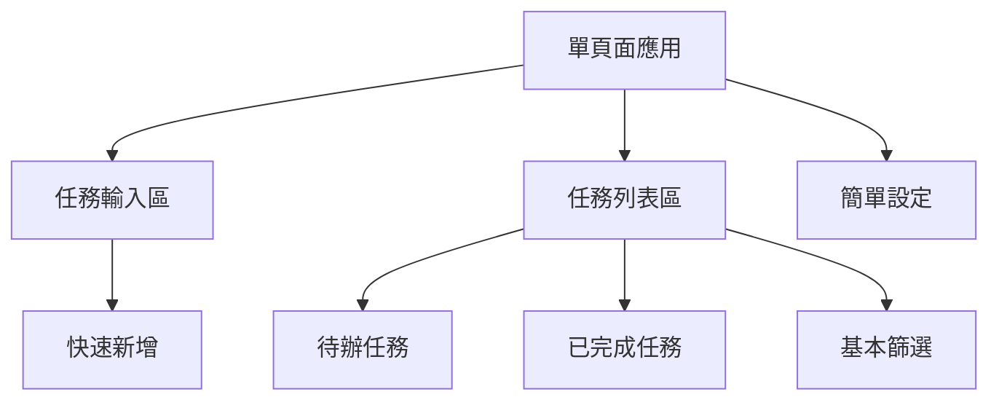
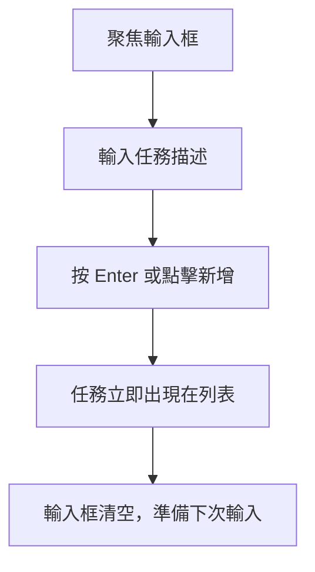

# ToDoListBDD UI/UX Specification (簡化版)

本文件定義 ToDoListBDD 簡化版待辦清單應用的使用者體驗目標、資訊架構、使用者流程和視覺設計規格。

## 🎯 專案重新定位

**新定位**：單人使用的簡潔待辦清單網頁應用
- 無需登入或用戶管理
- 無需複雜的專案管理功能
- 專注於基本任務管理和優美的使用者體驗
- 使用瀏覽器本地儲存

## Overall UX Goals & Principles

### Target User Persona

**個人生產力使用者：** 需要簡單、快速、美觀的待辦清單工具的個人用戶
- 重視簡潔和速度
- 希望有良好的視覺體驗
- 主要在網頁瀏覽器中使用
- 不需要複雜的組織功能

### Usability Goals

- **即時回應：** 所有操作都應在 100ms 內回應
- **零學習曲線：** 新使用者無需指導即可開始使用
- **快速輸入：** 新增任務應在 2 秒內完成
- **視覺愉悅：** 提供令人愉快的視覺回饋
- **跨瀏覽器一致：** 在主流瀏覽器中提供相同體驗

### Design Principles

1. **極簡優於複雜** - 每個功能都必須證明其必要性
2. **速度優於功能** - 快速完成任務比豐富功能更重要
3. **美觀激勵使用** - 優美的設計鼓勵持續使用
4. **鍵盤友善** - 支援基本的鍵盤快捷鍵
5. **本地優先** - 所有操作本地完成，無需網路依賴

### Change Log

| Date | Version | Description | Author |
|------|---------|-------------|--------|
| 2025-08-21 | 2.0 | 簡化版本，移除複雜功能 | PM |

## Information Architecture (IA)

### 簡化的應用架構



### Navigation Structure

**單頁面設計**：所有功能在一個頁面中，無需複雜導航
- 頂部：快速新增任務輸入框
- 中間：任務列表（待辦/已完成切換）
- 底部：簡單的設定選項

## Core User Flows

### 快速新增任務

**User Goal:** 立即捕捉想法，不中斷思路

**Entry Points:** 頁面頂部輸入框、鍵盤快捷鍵 (Ctrl+N)

**Success Criteria:** 任務在 1 秒內新增到列表



### 標記任務完成

**User Goal:** 獲得完成任務的成就感

**Entry Points:** 點擊任務勾選框、鍵盤快捷鍵

**Success Criteria:** 視覺回饋明確，任務狀態更新

### 編輯任務

**User Goal:** 修正或更新任務描述

**Entry Points:** 雙擊任務文字

**Success Criteria:** 內聯編輯，即時儲存

### 刪除任務

**User Goal:** 移除不需要的任務

**Entry Points:** 懸停顯示刪除按鈕

**Success Criteria:** 確認提示後安全刪除

## Key Screen Layout

### 單頁面佈局 (桌面版)

```
┌─────────────────────────────────────────────────────────────────┐
│                        ToDoListBDD                             │
├─────────────────────────────────────────────────────────────────┤
│                                                                 │
│ ┌─────────────────────────────────────────────────────────────┐ │
│ │ ⚡ 新增任務...                               [+ 新增]    │ │
│ └─────────────────────────────────────────────────────────────┘ │
│                                                                 │
│ ┌─────────────────────────────────────────────────────────────┐ │
│ │ [待辦 (5)] [已完成 (12)]                      🔍 篩選... │ │
│ └─────────────────────────────────────────────────────────────┘ │
│                                                                 │
│ ┌─────────────────────────────────────────────────────────────┐ │
│ │ ☐ 完成專案提案                                   [編輯][×] │ │
│ │ ☐ 回覆客戶郵件                                   [編輯][×] │ │
│ │ ☐ 準備會議資料                                   [編輯][×] │ │
│ │ ☐ 學習新技術                                     [編輯][×] │ │
│ │ ☐ 更新個人網站                                   [編輯][×] │ │
│ └─────────────────────────────────────────────────────────────┘ │
│                                                                 │
│ ┌─────────────────────────────────────────────────────────────┐ │
│ │                 [清除已完成] [設定]                        │ │
│ └─────────────────────────────────────────────────────────────┘ │
└─────────────────────────────────────────────────────────────────┘
```

### 手機版佈局

```
┌─────────────────────────────┐
│       ToDoListBDD           │
├─────────────────────────────┤
│ ┌─────────────────────────┐ │
│ │ + 新增任務...           │ │
│ └─────────────────────────┘ │
│                             │
│ [待辦 (5)] [已完成 (12)]   │
│                             │
│ ┌─────────────────────────┐ │
│ │ ☐ 完成專案提案        × │ │
│ │ ☐ 回覆客戶郵件        × │ │
│ │ ☐ 準備會議資料        × │ │
│ │ ☐ 學習新技術          × │ │
│ │ ☐ 更新個人網站        × │ │
│ └─────────────────────────┘ │
│                             │
│ [清除已完成] [設定]        │
└─────────────────────────────┘
```

## Simplified Component Library

### 核心組件

#### 任務項目
- **目的**：顯示單一任務和基本操作
- **狀態**：待辦、已完成、編輯中、懸停
- **交互**：勾選完成、雙擊編輯、懸停顯示刪除

#### 任務輸入框
- **目的**：快速新增任務
- **功能**：自動聚焦、Enter 提交、自動清空
- **樣式**：簡潔、明顯、引人注目

#### 篩選切換
- **目的**：在待辦和已完成間切換
- **樣式**：清楚的狀態指示

## Visual Design (保持不變)

### Color Palette
| Color Type | Hex Code | Usage |
|------------|----------|--------|
| Primary | #2563EB | 主要操作按鈕、連結 |
| Success | #22C55E | 完成狀態、正面回饋 |
| Warning | #F59E0B | 注意事項 |
| Error | #EF4444 | 刪除操作 |
| Neutral | #F8FAFC, #E2E8F0, #1E293B | 文字、邊框、背景 |

### Typography
- **Primary Font**: Inter
- **Font Sizes**: H1(24px), Body(16px), Small(14px)

### Spacing
- **Grid**: 8px 基準
- **Scale**: 8px, 16px, 24px, 32px

## Technical Requirements

### Local Storage Strategy
- 使用 localStorage 儲存任務資料
- JSON 格式，包含 id, text, completed, created, updated
- 定期清理已完成任務（可選）

### Performance Goals
- **首次載入**: < 1 秒
- **操作回應**: < 100ms
- **動畫**: 60fps

### Browser Support
- Chrome 80+
- Firefox 75+
- Safari 13+
- Edge 80+

## Accessibility (保持相同標準)

- WCAG 2.1 AA 合規
- 鍵盤導航支援
- 螢幕閱讀器友善
- 適當的色彩對比

## Next Steps

### Immediate Actions
1. ✅ 創建簡化的前端規格
2. 📋 創建對應的簡化 PRD
3. 🎨 調整 wireframes 移除複雜功能
4. 🏗️ 制定簡化的技術架構

### Success Metrics
- 載入速度 < 1 秒
- 新增任務操作 < 2 秒
- 零學習曲線（無需教學）
- 高視覺滿意度