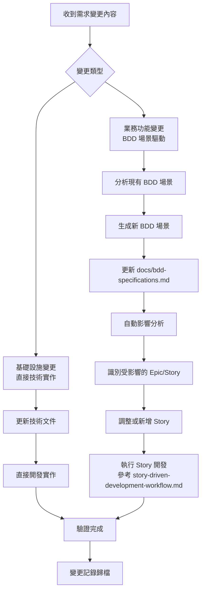

# 需求變更管理流程（簡化版）

## 概覽

本文件定義 ToDoListBDD 專案的輕量級需求變更流程，專為開發團隊設計，避免繁重的會議和決策流程，聚焦於快速將需求變更轉換為 BDD 場景並執行開發。

## 變更管理原則

### 核心原則
1. **開發優先**: 專注開發工作，減少非必要的管理流程
2. **快速轉換**: 需求變更內容快速轉換為 BDD 場景
3. **自動化處理**: 儘可能自動化變更分析和處理
4. **即時更新**: BDD 文件即時更新，保持同步
5. **簡單可追溯**: 簡單但完整的變更記錄

### 變更分類

#### A. 基礎設施變更
- **範圍**: 技術架構、開發工具、CI/CD 流程
- **影響**: 主要影響開發效率和系統穩定性
- **處理**: 技術評估驅動

#### B. 業務功能變更  
- **範圍**: 用戶功能、BDD 場景、業務邏輯
- **影響**: 直接影響用戶價值和產品功能
- **處理**: BDD 場景驅動

## 簡化變更流程總覽



## 步驟 1: 收到需求變更內容

### 1.1 輸入格式

**簡化變更內容格式：**
```markdown
# 需求變更 - [日期]

## 變更描述
[用簡單的語言描述需要什麼功能或變更]

## 範例：
用戶希望可以為每個任務設定優先順序（高、中、低），
並且可以按優先順序排序任務列表。
```

### 1.2 快速分類

**自動分類邏輯：**
- 包含「用戶」、「功能」、「操作」→ 業務功能變更
- 包含「技術」、「架構」、「環境」→ 基礎設施變更
- 不確定 → 預設為業務功能變更

## 步驟 2: 從需求內容生成 BDD 場景

### 2.1 業務功能變更處理

**範例需求：** 用戶希望可以為每個任務設定優先順序（高、中、低），並且可以按優先順序排序任務列表。

#### Step 1: 分析需求並生成 BDD 場景

**分析思路：**
```markdown
需求分析：
1. 用戶行為：設定任務優先順序
2. 資料輸入：高、中、低三個選項
3. 用戶行為：按優先順序排序
4. 系統回應：任務重新排序顯示

生成的 BDD 場景：
- 設定任務優先順序
- 查看不同優先順序的任務
- 按優先順序排序任務列表
```

**生成的 BDD 場景：**
```gherkin
### Scenario 10: 設定任務優先順序

Scenario: 為新任務設定優先順序
  Given 我在待辦清單主頁面
  When 我在輸入框中輸入 "完成專案報告"
  And 我選擇優先順序為 "高"
  And 我按下 Enter 鍵或點擊新增按鈕
  Then 我應該看到新任務 "完成專案報告" 出現在待辦任務列表中
  And 任務應該顯示 "高" 優先順序標記

Scenario: 修改現有任務的優先順序
  Given 我有一個待辦任務 "準備會議資料"
  When 我點擊該任務的優先順序區域
  Then 應該顯示優先順序選擇器（高、中、低）
  When 我選擇 "高"
  Then 任務的優先順序應該更新為 "高"
  And 任務列表應該重新排序

### Scenario 11: 按優先順序排序任務

Scenario: 按優先順序顯示任務
  Given 我有以下任務：
    | 任務描述 | 優先順序 | 狀態 |
    | 完成專案報告 | 高 | 待辦 |
    | 準備會議資料 | 中 | 待辦 |
    | 回覆郵件 | 低 | 待辦 |
  When 我選擇 "按優先順序排序"
  Then 我應該看到任務按以下順序顯示：
    | 順序 | 任務描述 |
    | 1 | 完成專案報告 |
    | 2 | 準備會議資料 |
    | 3 | 回覆郵件 |
```

#### Step 2: 自動更新 BDD 文件

```bash
# 自動將新場景加入 docs/bdd-specifications.md
echo "新場景已加入 BDD 規格文件"
```

### 2.2 基礎設施變更處理

基礎設施變更直接進入技術實作，不需要生成 BDD 場景。

**處理流程：**
1. 更新相關技術文件
2. 直接開始技術實作
3. 完成後更新變更記錄

## 步驟 3: 自動影響分析

### 3.1 識別受影響的 Epic 和 Story

**基於新增的 BDD 場景，自動分析：**

```bash
# 自動化影響分析腳本
./scripts/analyze-bdd-impact.sh "新場景關鍵字"

# 輸出範例：
受影響的 Epic:
- Epic 2: 核心任務管理 (需要擴展)

建議新增的 Story:
- Story 2.5: 任務優先順序設定
- Story 2.6: 按優先順序排序任務

需要調整的現有 Story:
- Story 2.1: 新增待辦任務 (需加入優先順序選擇)
```

### 3.2 自動生成 Story 建議

**範例輸出：**
```markdown
## 建議的 Story 調整

### 新增 Story 2.5: 任務優先順序設定
**對應 BDD 場景：** Scenario 10 - 設定任務優先順序
**Story 描述：** 作為用戶，我想要為任務設定優先順序，以便重要任務優先處理。
**預估複雜度：** 中等

### 新增 Story 2.6: 按優先順序排序
**對應 BDD 場景：** Scenario 11 - 按優先順序排序任務  
**Story 描述：** 作為用戶，我想要按優先順序查看任務，以便專注於重要工作。
**預估複雜度：** 簡單

### 調整 Story 2.1: 新增待辦任務
**調整原因：** 需要加入優先順序選擇功能
**調整範圍：** 在新增任務時加入優先順序選擇器
```

## 步驟 4: 開始 Story 開發

### 4.1 直接執行 Story

**對於新增的 Story：**
- 按照 `story-driven-development-workflow.md` 執行
- 每個 Story 都有明確的 BDD 場景作為開發指導

**對於調整的 Story：**  
- 更新 Story 的完成條件
- 按照 `story-driven-development-workflow.md` 執行調整部分

### 4.2 開發檢查清單

```markdown
## Story 開發檢查清單

### Story 2.5: 任務優先順序設定
- [ ] 讀取對應的 BDD 場景 (Scenario 10)
- [ ] 分析技術需求 (API, 資料模型, UI)
- [ ] 建立 Story 專用的技術文件
- [ ] 撰寫 BDD 測試
- [ ] 實作功能
- [ ] 驗證 BDD 場景通過
- [ ] 完成 Story

### Story 2.6: 按優先順序排序
- [ ] 讀取對應的 BDD 場景 (Scenario 11)
- [ ] 分析技術需求
- [ ] 建立技術文件
- [ ] 撰寫 BDD 測試
- [ ] 實作功能  
- [ ] 驗證 BDD 場景通過
- [ ] 完成 Story
```

## 步驟 5: 簡單記錄

### 5.1 變更記錄

**完成變更後，簡單記錄：**
```markdown
# 變更記錄 - [日期]

## 變更內容
[原始需求描述]

## 新增的 BDD 場景
- Scenario 10: 設定任務優先順序
- Scenario 11: 按優先順序排序任務

## 新增/調整的 Story
- Story 2.5: 任務優先順序設定 ✅ 已完成
- Story 2.6: 按優先順序排序 ✅ 已完成
- Story 2.1: 新增待辦任務 ✅ 已調整

## 驗證結果
- [ ] 所有相關 BDD 場景通過測試
- [ ] 功能運作正常
- [ ] 用戶可以正常使用新功能
```

## 自動化工具支援

### 需求到 BDD 場景轉換工具

```bash
#!/bin/bash
# scripts/requirement-to-bdd.sh

# 需求分析和 BDD 場景生成工具
echo "=== 需求變更處理工具 ==="

# 讀取需求內容
echo "請輸入需求變更內容："
read REQUIREMENT

# 簡單的關鍵字分析
if echo "$REQUIREMENT" | grep -qi "用戶\|功能\|操作"; then
    echo "檢測到業務功能變更，開始生成 BDD 場景..."
    
    # 生成 BDD 場景範本
    SCENARIO_FILE="temp-scenario-$(date +%Y%m%d).md"
    
    cat > "$SCENARIO_FILE" << EOF
### 新場景: [場景名稱]

Scenario: [場景描述]
  Given [前置條件]
  When [用戶操作]
  Then [預期結果]
  And [額外驗證]

## 需求來源
$REQUIREMENT

## 建議的 Story
- Story X.X: [Story 名稱] - [Story 描述]

## 影響分析
- 新增 API: [API 端點]
- 資料模型: [影響的實體]
- 前端元件: [影響的元件]
EOF

    echo "BDD 場景範本已生成：$SCENARIO_FILE"
    echo "請手動完善場景內容，然後加入到 docs/bdd-specifications.md"
    
else
    echo "檢測到基礎設施變更，直接進入技術實作階段"
fi
```

### BDD 影響分析工具

```bash
#!/bin/bash
# scripts/analyze-bdd-impact.sh

KEYWORD=$1

echo "=== BDD 影響分析 ==="
echo "分析關鍵字: $KEYWORD"

# 搜尋現有 BDD 場景
echo "相關的現有場景："
grep -n "$KEYWORD" docs/bdd-specifications.md || echo "無相關現有場景"

# 分析 Epic 影響
echo ""
echo "可能受影響的 Epic："
echo "- Epic 2: 核心任務管理 (如果與任務 CRUD 相關)"
echo "- Epic 3: 進階功能 (如果是新增功能)"

# 建議新 Story
echo ""
echo "建議新增的 Story："
echo "- Story X.X: [$KEYWORD 相關功能]"
```

### 變更記錄工具

```bash
#!/bin/bash
# scripts/log-change.sh

DATE=$(date +%Y-%m-%d)
LOG_FILE="docs/change-logs/change-$DATE.md"

mkdir -p docs/change-logs

cat > "$LOG_FILE" << EOF
# 變更記錄 - $DATE

## 變更內容
[請填入原始需求描述]

## 新增的 BDD 場景
- [ ] Scenario X: [場景名稱]

## 新增/調整的 Story  
- [ ] Story X.X: [Story 名稱]

## 驗證結果
- [ ] BDD 場景測試通過
- [ ] 功能運作正常
- [ ] 用戶驗收完成

## 完成日期
[完成後請填入]
EOF

echo "變更記錄檔案已建立：$LOG_FILE"
```

## 使用範例

### 完整變更處理範例

**Step 1: 收到需求變更**
```
需求變更：用戶希望可以為每個任務設定優先順序（高、中、低），並且可以按優先順序排序任務列表。
```

**Step 2: 執行工具**
```bash
# 執行需求分析工具
./scripts/requirement-to-bdd.sh

# 輸入需求內容後，工具生成 BDD 場景範本
```

**Step 3: 完善 BDD 場景**
手動完善生成的場景，加入到 `docs/bdd-specifications.md`

**Step 4: 影響分析**
```bash
# 分析影響
./scripts/analyze-bdd-impact.sh "優先順序"
```

**Step 5: 開始開發**
按照工具建議的 Story 清單，執行 `story-driven-development-workflow.md`

**Step 6: 記錄變更**
```bash
# 完成後記錄
./scripts/log-change.sh
```

## 總結

這個簡化的變更管理流程專為開發團隊設計，特色：

1. **無會議**: 不需要冗長的決策會議
2. **快速轉換**: 需求內容直接轉換為 BDD 場景
3. **工具支援**: 提供自動化工具協助處理
4. **專注開發**: 聚焦於開發工作，減少管理負擔
5. **保持追蹤**: 簡單但完整的變更記錄

**核心流程：** 需求內容 → 生成 BDD 場景 → 影響分析 → Story 開發 → 簡單記錄