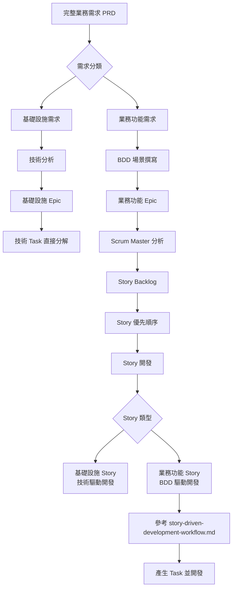

# Epic 與 Story 規劃流程

## 概覽

本文件定義從完整需求到 Epic 規劃，再到 Scrum Master 產生 Story 的完整流程，並明確區分基礎設施和業務功能的不同處理方式。

## 流程總覽



## 階段 1: 需求分析與分類

### 1.1 完整需求收集

**輸入：** PRD 文件中的所有需求
**輸出：** 分類後的需求列表

**分類標準：**

#### A. 基礎設施需求
- **特徵**: 技術性、使用者不可見、系統運行必需
- **範例**:
  - 建立開發環境
  - 配置 CI/CD 管道
  - 設定資料庫連接
  - 建立測試框架
  - 部署環境準備

#### B. 業務功能需求  
- **特徵**: 用戶可見、有明確業務價值、可描述為用戶行為
- **範例**:
  - 新增待辦任務
  - 標記任務完成
  - 搜尋任務
  - 刪除任務

### 1.2 需求分類實作

**工具：** 需求分類檢查表

```markdown
## 需求分類檢查表

對每個需求檢查以下問題：

1. **用戶可見性**
   - [ ] 用戶可以直接感知到這個功能嗎？
   - [ ] 這個功能會改變用戶界面嗎？

2. **業務價值**
   - [ ] 這個功能解決了用戶的具體問題嗎？
   - [ ] 用戶會主動使用這個功能嗎？

3. **技術性質**
   - [ ] 這是系統運行的必要基礎嗎？
   - [ ] 這個功能主要是為了支援其他功能嗎？

**判斷：**
- 如果 1-2 都是 ✓ → 業務功能需求
- 如果主要是 3 ✓ → 基礎設施需求
```

## 階段 2: Epic 規劃

### 2.1 基礎設施 Epic 規劃

**特色：** 技術驅動，可預先完整規劃

**規劃流程：**
```
技術需求分析 → 技術選型 → 架構設計 → Task 分解 → 實作計劃
```

**Epic 結構範例：**
```markdown
# Epic 1: 基礎設施建立

## 目標
建立完整的開發和部署基礎設施

## 範圍
- Angular 19 專案架構建立
- .NET 9 Web API 專案建立
- MediatR CQRS 框架配置
- SQLite 資料庫設定
- 測試框架建立（Jest, xUnit, SpecFlow）
- CI/CD 管道配置
- Docker 容器化
- 部署環境準備

## 技術 Task 分解
1. **T1.1**: 建立 Angular 19 專案結構
2. **T1.2**: 配置 .NET 9 Web API 專案
3. **T1.3**: 整合 MediatR 和 CQRS 模式
4. **T1.4**: 設定 SQLite 和 Entity Framework Core
5. **T1.5**: 建立測試框架基礎設施
6. **T1.6**: 配置 CI/CD 管道
7. **T1.7**: Docker 容器化設定
8. **T1.8**: 部署環境配置

## 完成標準
- [ ] 所有技術框架正常運作
- [ ] 開發環境可以正常建置和執行
- [ ] 測試框架可以執行基礎測試
- [ ] CI/CD 管道可以自動建置和測試
- [ ] 可以部署到測試環境
```

### 2.2 業務功能 Epic 規劃

**特色：** BDD 驅動，基於用戶行為場景

**規劃流程：**
```
業務需求 → BDD 場景撰寫 → 場景分組 → Epic 定義 → SM 分析
```

**Epic 結構範例：**
```markdown
# Epic 2: 核心任務管理

## 目標
實作基礎的任務 CRUD 功能

## BDD 場景來源
`docs/bdd-specifications.md` - Scenario 1-4

## 涵蓋的業務場景
- Scenario 1: 新增待辦任務
- Scenario 2: 標記任務完成
- Scenario 3: 編輯任務內容  
- Scenario 4: 刪除任務

## Epic 特性
- 完全 BDD 驅動開發
- 每個 Story 基於具體 BDD 場景
- 技術實作基於場景需求推導

## 完成標準
- [ ] 所有相關 BDD 場景可以通過測試
- [ ] 用戶可以完成基本的任務管理操作
- [ ] 前後端 API 整合正常
- [ ] UI/UX 符合設計規格

## 交給 SM 進行 Story 分解
此 Epic 需要 Scrum Master 基於 BDD 場景進行 Story 分解
```

## 階段 3: Scrum Master Story 分解

### 3.1 Story 分解原則

**Story 大小：** 1-2 個 Sprint 可完成
**Story 價值：** 每個 Story 獨立提供業務價值
**Story 測試：** 每個 Story 有明確的完成條件

### 3.2 Story 分解方法

#### 方法 A: 按 BDD 場景分解（推薦）
每個主要 BDD 場景對應一個 Story

```markdown
## Story 分解範例：Epic 2 → Stories

### Story 2.1: 新增待辦任務
**對應 BDD 場景：** Scenario 1 - 新增待辦任務
**Story 描述：** 
作為用戶，我想要新增待辦任務，以便記錄我需要完成的工作。

**BDD 場景：**
- 成功新增待辦任務
- 無法新增空白任務

**完成條件：**
- [ ] 用戶可以在輸入框輸入任務描述
- [ ] 按 Enter 或點擊按鈕可以新增任務
- [ ] 新任務出現在待辦列表中
- [ ] 輸入框清空
- [ ] 空白任務會顯示錯誤提示
- [ ] 任務計數正確更新

### Story 2.2: 標記任務完成狀態
**對應 BDD 場景：** Scenario 2 - 標記任務完成
**Story 描述：**
作為用戶，我想要標記任務的完成狀態，以便跟蹤我的進度。

**BDD 場景：**
- 成功標記任務為已完成
- 重新標記已完成任務為待辦

**完成條件：**
- [ ] 點擊勾選框可以切換任務狀態
- [ ] 已完成任務顯示劃線效果
- [ ] 任務計數正確更新
- [ ] 狀態變更有視覺回饋

### Story 2.3: 編輯任務內容
... (類似結構)

### Story 2.4: 刪除任務
... (類似結構)
```

#### 方法 B: 按功能層級分解
前端 Story 和後端 Story 分開

```markdown
### Story 2.1-BE: 任務管理後端 API
**範圍：** 實作任務 CRUD 的後端 API
**技術重點：** CQRS Commands/Queries, Repository

### Story 2.1-FE: 任務管理前端 UI  
**範圍：** 實作任務管理的前端介面
**技術重點：** Angular 元件, 狀態管理, API 整合
```

### 3.3 Story Backlog 管理

**工具：** Jira / Azure DevOps / GitHub Issues

**Story 優先順序原則：**
1. **基礎設施優先：** Epic 1 所有 Stories 必須先完成
2. **依賴關係：** 有依賴的 Story 先做被依賴的
3. **業務價值：** 核心功能優先於進階功能
4. **風險管理：** 技術風險高的 Story 提前做

**Story Backlog 範例：**
```
Sprint 1:
- Story 1.1: Angular 專案架構建立 (基礎設施)
- Story 1.2: .NET API 專案建立 (基礎設施)

Sprint 2:  
- Story 1.3: CQRS 框架配置 (基礎設施)
- Story 1.4: 資料庫設定 (基礎設施)

Sprint 3:
- Story 1.5: 測試框架建立 (基礎設施)
- Story 2.1: 新增待辦任務 (業務功能)

Sprint 4:
- Story 2.2: 標記任務完成狀態 (業務功能)  
- Story 2.3: 編輯任務內容 (業務功能)

...
```

## 階段 4: Story 開發執行

### 4.1 Story 開發流程分歧

#### 路徑 A: 基礎設施 Story
```
Story 開始 → 技術分析 → 架構設計 → 實作 → 測試 → 完成
```

**特色：**
- 技術需求驅動
- 可以預先設計
- 重點在正確性和可維護性

#### 路徑 B: 業務功能 Story  
```
Story 開始 → 參考 story-driven-development-workflow.md → 產生 Task → BDD 驅動開發
```

**特色：**
- BDD 場景驅動
- Just-in-Time 設計
- 重點在符合用戶需求

### 4.2 Story 開發最佳實踐

#### Sprint Planning
1. **Story 細分：** 將 Story 分解為具體的 Task  
2. **估算：** 使用 Planning Poker 估算 Story Point
3. **分配：** 根據團隊能力分配 Story
4. **依賴識別：** 確認 Story 間的依賴關係

#### Daily Standup
1. **進度同步：** 每個 Story 的完成狀態
2. **阻礙處理：** 識別和解決阻礙
3. **協作需求：** 跨 Story 的協作需求

#### Sprint Review
1. **Demo：** 展示完成的 Story 功能
2. **BDD 驗證：** 確認業務功能 Story 符合 BDD 場景
3. **Retrospective：** 流程改善建議

## 工具和範本

### Story 範本

```markdown
# Story [編號]: [標題]

## Story 描述
作為 [角色]，我想要 [功能]，以便 [價值]。

## 對應 BDD 場景 (僅業務功能 Story)
- 場景名稱：[BDD 場景名稱]
- 檔案位置：docs/bdd-specifications.md - Scenario [X]

## 完成條件 (Definition of Done)
- [ ] [具體可驗證的條件 1]
- [ ] [具體可驗證的條件 2]
- [ ] ...

## Task 分解
- [ ] Task 1: [具體技術任務]
- [ ] Task 2: [具體技術任務]
- [ ] ...

## 估算
Story Point: [點數]
預估時間: [小時]

## 依賴
- 依賴 Story: [Story 編號]
- 被依賴 Story: [Story 編號]

## 開發注意事項
[技術細節、特殊要求等]
```

### Epic 追蹤看板

```
Epic Kanban Board:

To Do          | In Progress    | Review        | Done
---------------|----------------|---------------|-------------
Epic 1: 基礎設施 |                |               |
Epic 2: 核心功能 |                |               |
Epic 3: 進階功能 |                |               |
Epic 4: 系統優化 |                |               |
```

## 成功指標

### Epic 層級
- **基礎設施 Epic**: 技術框架正常運作，開發效率提升
- **業務功能 Epic**: BDD 場景 100% 通過，用戶價值實現

### Story 層級  
- **完成時間**: 在預估時間內完成
- **品質標準**: 所有 DoD 條件滿足
- **BDD 符合**: 業務功能 Story 的 BDD 測試通過

### 專案層級
- **交付時間**: 按 Epic 順序及時交付
- **品質**: 無重大缺陷
- **流程**: BDD 驅動流程順暢運行

這個流程確保從完整需求到 Story 實作的每個階段都有明確的責任分工和執行標準，同時區分了基礎設施和業務功能的不同處理方式。