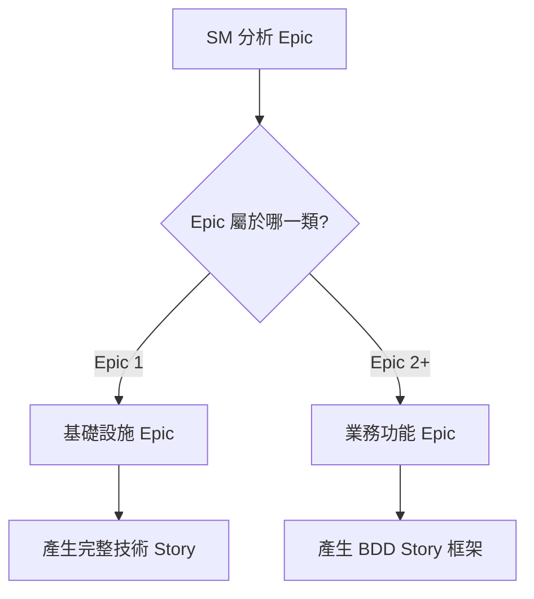
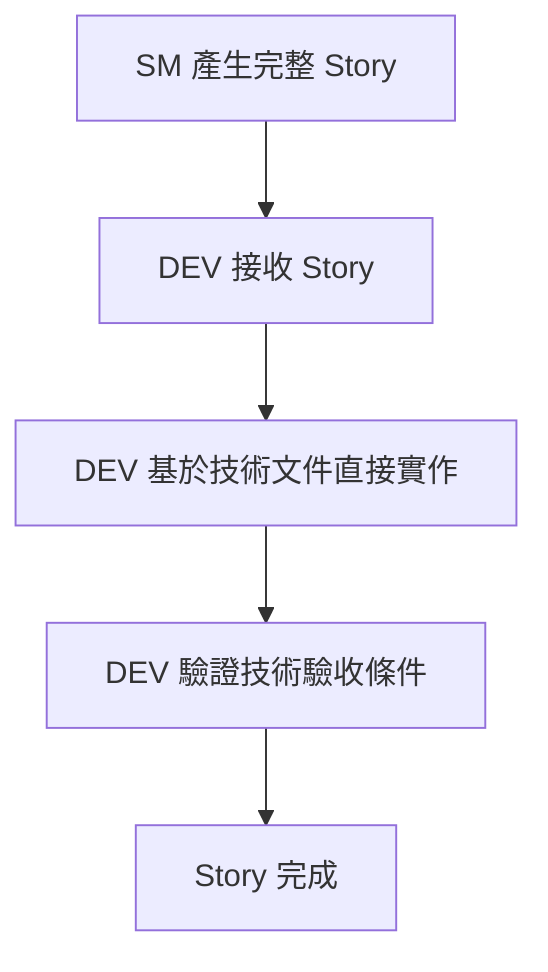
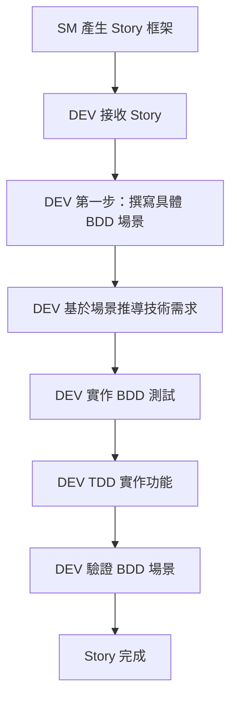

# Scrum Master Story 產生流程 (雙軌模式)

## 概覽

本文件定義 Scrum Master (SM) 如何基於 Epic 類型產生不同類型的 Story，支援 **基礎設施任務(技術驅動)** 和 **業務功能任務(BDD驅動)** 兩種開發模式。

## 🚀 雙軌 Story 產生策略

### Epic 類型識別

**在產生任何 Story 前，SM 必須先確定 Epic 類型：**



---

## 🏗️ 基礎設施 Epic 的 Story 產生 (Epic 1)

### SM 職責：產生完整的技術任務 Story

#### 輸入來源
- `docs/architecture.md` - 技術架構文件
- `docs/prd-final.md` - 技術棧和非功能性需求
- Epic 1 的總體目標

#### 產生流程

**第一步：分析技術需求**
```markdown
1. 讀取架構文件中對應的技術需求
2. 識別具體的技術實作任務
3. 確定技術依賴關係和順序
4. 定義可驗證的技術驗收條件
```

**第二步：使用基礎設施 Story 範本**
```bash
# SM 使用腳本建立基礎設施 Story
scripts/create-infrastructure-story.sh [編號] "[技術任務標題]"
```

**第三步：完整填寫 Story 內容**
SM 必須完整填寫以下內容：

```markdown
# Story [編號]: [技術任務標題]

## Story 類型
基礎設施 Story (Epic 1) - 技術驅動

## 技術目標
[SM 基於架構文件定義的具體技術目標]

## 具體任務清單
1. [ ] [SM 定義的具體技術任務 1]
2. [ ] [SM 定義的具體技術任務 2]  
3. [ ] [SM 定義的具體技術任務 3]

## 驗收條件
- [ ] [SM 定義的技術功能驗證]
- [ ] [SM 定義的配置檔案檢查]
- [ ] [SM 定義的測試執行要求]
- [ ] [SM 定義的文件更新要求]
```

#### SM 產生基礎設施 Story 的範例

```markdown
# Story 1: 建立 Angular 專案架構

## Story 類型
基礎設施 Story (Epic 1) - 技術驅動

## 技術目標
建立 Angular 19 前端專案的基礎架構，配置開發環境為 PORT 4200，準備後續業務功能開發所需的基礎

## 具體任務清單
1. [ ] 執行 `ng new todolist-frontend --routing --style=scss --port=4200`
2. [ ] 建立 src/app/features/todo 功能模組資料夾
3. [ ] 建立 src/app/core 和 src/app/shared 模組
4. [ ] 配置 angular.json 確保 dev server 使用 PORT 4200
5. [ ] 安裝和配置 ESLint、Prettier
6. [ ] 建立基礎的 Dockerfile 和 docker-compose 配置
7. [ ] 設置 TypeScript 編譯選項符合專案需求

## 驗收條件
- [ ] `ng serve` 可以在 PORT 4200 正常啟動應用
- [ ] 資料夾結構符合 architecture.md 設計
- [ ] ESLint 和 Prettier 規則正常運作
- [ ] Docker 環境可以正常建置和啟動
- [ ] 基礎模組可以正常 import 和使用
- [ ] 相關設定文件已建立且配置正確

## 實作方針
**注意：基礎設施 Story 不需要 BDD 場景，直接基於技術文件實作**

### 相關技術文件
- docs/architecture.md (前端架構部分)
- docs/prd-final.md (技術棧 Angular 19 部分)

## 完成檢查
- [ ] 功能可以正常運作且符合 Windows 開發環境要求
- [ ] 無明顯技術債務
- [ ] 相關文件已更新
- [ ] 為後續業務功能 Story 提供穩固基礎
```

---

## 🎯 業務功能 Epic 的 Story 產生 (Epic 2+)

### SM 職責：產生 BDD Story 框架，DEV 補完場景

#### 輸入來源
- `docs/prd-final.md` - 功能需求 (FR1-FR10)
- Epic 2+ 的業務目標
- 用戶價值和使用情境

#### 產生流程

**第一步：分析功能需求**
```markdown
1. 讀取 PRD 中對應的功能需求 (FR編號)
2. 識別使用者角色和使用情境
3. 確定業務價值和期望行為
4. 規劃 BDD 場景的概念框架
```

**第二步：使用業務功能 Story 範本**
```bash
# SM 使用腳本建立業務功能 Story
scripts/create-feature-story.sh [編號] "[業務功能標題]"
```

**第三步：填寫 Story 框架**
SM 填寫 Story 框架，**但將 BDD 場景具體撰寫留給 DEV**：

```markdown
# Story [編號]: [業務功能標題]

## Story 類型
業務功能 Story (Epic 2+) - BDD 驅動

## ⚡ 第一步：撰寫 BDD 場景 (DEV 必須完成才能繼續)

### 功能需求對應
對應 PRD 功能需求: [SM 指定對應的 FR 編號]

### 使用者價值
[SM 描述業務價值和使用者期望]

### BDD 場景框架
```gherkin
Feature: [SM 定義功能名稱]
  As a [SM 定義使用者角色]
  I want to [SM 定義期望行為]
  So that [SM 定義業務價值]

# ⚠️ DEV 任務：在此撰寫具體的 Background 和 Scenario
# 必須包含：主要成功場景、邊界條件、錯誤處理場景

[DEV 在實作時補完具體場景]
```

### 預期場景類型
[SM 提供場景指導]
- 主要成功場景：[SM 描述預期的正常流程]
- 邊界條件場景：[SM 提醒需要考慮的邊界情況]
- 錯誤處理場景：[SM 提醒需要處理的錯誤情況]
```

#### SM 產生業務功能 Story 的範例

```markdown
# Story 2: 實作新增任務功能

## Story 類型
業務功能 Story (Epic 2) - BDD 驅動

## ⚡ 第一步：撰寫 BDD 場景 (DEV 必須完成才能繼續)

### 功能需求對應
對應 PRD 功能需求: FR1 - 用戶可以在輸入框中快速新增待辦任務

### 使用者價值
讓生產力使用者能夠快速捕捉想法，將腦中的待辦事項立即記錄下來，而不中斷當前的思路和工作流程。

### BDD 場景框架
```gherkin
Feature: 新增待辦任務
  As a 生產力使用者
  I want to 快速新增待辦任務到清單中
  So that 我可以捕捉想法而不中斷思路

# ⚠️ DEV 任務：在此撰寫具體的 Background 和 Scenario
# 必須包含：主要成功場景、邊界條件、錯誤處理場景

[DEV 在實作時補完具體場景，參考以下指導]
```

### 預期場景類型
- 主要成功場景：用戶在輸入框輸入任務描述並成功新增到待辦清單
- 邊界條件場景：空白輸入、過長輸入、特殊字元輸入的處理
- 錯誤處理場景：API 錯誤、網路錯誤時的用戶回饋
- 使用者體驗場景：鍵盤快捷鍵 (Enter)、輸入框清空、即時回饋

### Story 優先序理由
此 Story 是核心功能的基礎，所有其他任務管理功能都依賴於能夠新增任務。應該優先實作。

## 第二步：技術需求推導 (基於 BDD 場景)
[DEV 基於撰寫的 BDD 場景填寫]

## 第三步：BDD 測試實作
[DEV 基於 BDD 場景實作測試]

## 第四步：程式碼實作 (TDD)
[DEV 基於測試驅動開發實作功能]

## BDD 驗收條件
- [ ] 所有前端 BDD 測試通過
- [ ] 所有後端 BDD 測試通過  
- [ ] E2E BDD 測試通過
- [ ] 手動驗證每個 BDD 場景
- [ ] 邊界條件和錯誤情況測試通過
```

---

## 📋 SM Story 產生檢查清單

### 基礎設施 Story (Epic 1) 檢查清單

**SM 必須確保：**
- [ ] 技術目標明確且可執行
- [ ] 具體任務清單完整且有順序
- [ ] 驗收條件可驗證且具體
- [ ] 相關技術文件已引用
- [ ] 任務符合架構設計
- [ ] 為後續 Story 提供基礎

### 業務功能 Story (Epic 2+) 檢查清單

**SM 必須確保：**
- [ ] 對應的 FR 編號正確
- [ ] 使用者價值描述清楚
- [ ] Feature 名稱和角色定義明確
- [ ] 預期場景類型指導完整
- [ ] 明確標示 DEV 需要補完 BDD 場景
- [ ] Story 優先序理由合理
- [ ] 與其他 Story 的依賴關係清楚

---

## 🔄 Story 產生後的流程

### 基礎設施 Story 流程


### 業務功能 Story 流程  


---

## 🛠️ SM 使用的工具和腳本

### Windows 環境
```batch
# 建立基礎設施 Story
scripts\create-infrastructure-story.bat 1 "建立Angular專案架構"

# 建立業務功能 Story  
scripts\create-feature-story.bat 2 "實作新增任務功能"
```

### Linux/Mac 環境
```bash
# 建立基礎設施 Story
scripts/create-infrastructure-story.sh 1 "建立Angular專案架構"

# 建立業務功能 Story
scripts/create-feature-story.sh 2 "實作新增任務功能"
```

---

## 📝 Story 品質標準

### 高品質基礎設施 Story 特徵
- ✅ 技術目標基於架構文件且具體
- ✅ 任務清單可執行且有邏輯順序
- ✅ 驗收條件可驗證且完整
- ✅ 為業務功能 Story 提供穩固基礎

### 高品質業務功能 Story 特徵  
- ✅ 業務價值明確且有說服力
- ✅ Feature 定義符合用戶需求
- ✅ 場景指導完整且實用
- ✅ 明確區分 SM 責任與 DEV 責任
- ✅ DEV 可以基於框架順利開展 BDD 驅動開發

---

## 🎯 總結

這個雙軌 Story 產生流程確保：

1. **基礎設施 Story** - SM 產生完整的技術任務，DEV 直接實作
2. **業務功能 Story** - SM 產生 BDD 框架，DEV 補完場景並驅動開發
3. **責任清晰** - SM 負責業務分析和框架，DEV 負責技術細節
4. **流程一致** - 兩種 Story 都有清楚的產生和執行流程
5. **BDD 支援** - 完全支援 BDD Just-in-Time 開發模式

**關鍵成功因素：SM 必須根據 Epic 類型選擇正確的 Story 產生策略！**