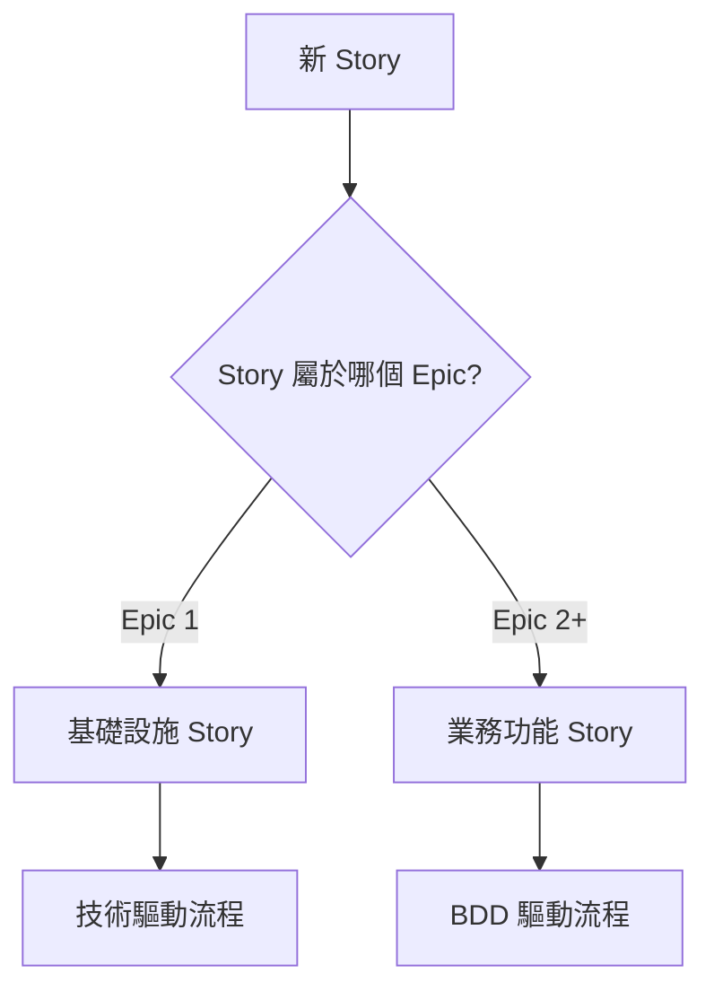

# Story-Driven 開發流程指南 (雙軌模式)

## 概覽

本文件定義 ToDoListBDD 專案的 Story 驅動開發流程，**區分基礎設施任務(技術驅動)和業務功能任務(BDD驅動)兩種不同的開發模式**。

## 🚀 雙軌開發模式

### 軌道 A: 基礎設施開發 (Epic 1)
- **驅動方式**: 技術需求驅動
- **適用範圍**: 專案架構、開發環境、CI/CD、測試框架
- **特點**: 不需要 BDD 場景，直接基於技術文件實作

### 軌道 B: 業務功能開發 (Epic 2+)  
- **驅動方式**: BDD 場景驅動
- **適用範圍**: 所有用戶可見功能
- **特點**: Story 第一步必須撰寫 BDD 場景

## 核心原則

### 1. Just-in-Time 設計 (僅適用於業務功能)
- **原則**: 只在需要時設計和實作
- **實踐**: 每個業務功能 Story 開始時才建立相關的技術文件和程式碼
- **避免**: 提前設計可能不需要或會變更的功能

### 2. BDD 場景驅動 (僅適用於業務功能)
- **原則**: 業務功能的所有技術決策基於 BDD 場景
- **實踐**: 從 BDD 場景推導出 API 設計、資料模型、測試
- **避免**: 脫離 BDD 場景的技術決策

### 3. 技術架構先行 (適用於基礎設施)
- **原則**: 基礎設施提供業務功能實作的基礎
- **實踐**: 基於架構文件和技術需求直接實作
- **目標**: 為後續的 BDD 驅動開發提供穩固基礎

### 4. 漸進式演進 (兩軌皆適用)
- **原則**: 系統隨著 Story 實作逐步演進
- **實踐**: 每個 Story 可能調整既有的設計和實作
- **避免**: 假設需求不會變更

## 🔀 Story 開發流程 (依類型區分)

### 📋 流程選擇指南

**在開始任何 Story 前，首先確定 Story 類型：**



---

## 🏗️ 基礎設施 Story 開發流程 (Epic 1)

### 適用範圍
- 專案初始化和架構設置
- 開發環境配置 (Angular + .NET + Docker)
- CI/CD 管道建立
- 測試框架建立 (SpecFlow, Cucumber, Selenium)
- 資料庫基礎設施設置
- 部署腳本和 DevOps 工具

### 階段 1: 技術需求分析

#### 1.1 讀取技術文件
```bash
# 基礎設施 Story 基於架構文件，不需要 BDD 場景
cat docs/architecture.md
cat docs/prd-final.md  # 查看技術棧和非功能性需求

# 識別當前 Story 對應的技術需求
# 範例：Story "建立 Angular 專案架構" 對應架構文件中的前端架構部分
```

#### 1.2 技術需求細化
基於架構文件，細化具體的技術實作任務：

```markdown
# 範例：Story "建立 Angular 專案架構"

## 技術目標
- 建立 Angular 19 專案
- 配置 TypeScript 和建置工具
- 設置基礎的資料夾結構
- 配置開發服務器在 PORT 4200

## 具體任務
1. 執行 `ng new todolist-frontend --routing --style=scss`
2. 建立 features/todo 模組資料夾
3. 配置 angular.json 中的 serve 設定
4. 建立基礎的 core/shared 模組
5. 設置 eslint 和 prettier
```

### 階段 2: 直接實作 (無需 BDD 場景)

#### 2.1 建立基礎架構
```bash
# 前端架構實作
ng new todolist-frontend --routing --style=scss --port=4200
cd todolist-frontend
ng generate module core
ng generate module shared
ng generate module features/todo

# 後端架構實作  
dotnet new webapi -n ToDoListBDD.API
dotnet add package MediatR
dotnet add package EntityFrameworkCore
dotnet add package EntityFrameworkCore.SQLite
```

#### 2.2 配置開發環境
```bash
# 配置 Docker 開發環境
touch Dockerfile.frontend
touch Dockerfile.backend  
touch docker-compose.yml

# 設置 CI/CD 基礎
mkdir -p .github/workflows
touch .github/workflows/frontend-ci.yml
touch .github/workflows/backend-ci.yml
```

### 階段 3: 測試框架設置

#### 3.1 建立測試基礎設施
```bash
# 前端測試框架
npm install --save-dev @cucumber/cucumber
npm install --save-dev karma jasmine

# 後端測試框架
dotnet add package SpecFlow
dotnet add package xUnit
dotnet add package Selenium.WebDriver

# E2E 測試
mkdir -p tests/e2e
touch tests/e2e/setup.js
```

### 階段 4: 驗證和文件更新

#### 4.1 驗證基礎設施
```bash
# 確認前端服務啟動
npm run serve  # 應在 PORT 4200 啟動

# 確認後端服務啟動
dotnet run     # 應在指定 PORT 啟動

# 確認測試框架
npm run test
dotnet test
```

#### 4.2 更新技術文件
- 更新 architecture.md 反映實際實作
- 記錄實際的配置檔案位置
- 更新部署說明

---

## 🎯 業務功能 Story 開發流程 (Epic 2+)

### 適用範圍
- 所有用戶可見的功能 (FR1-FR10)
- 任務管理核心功能 (新增、編輯、刪除、完成)
- 進階功能 (搜尋、篩選、快捷鍵)
- 用戶體驗優化

### ⚡ 關鍵差異：Story 第一步必須撰寫 BDD 場景！

### 階段 1: BDD 場景撰寫 (Story 第一步)

#### 1.1 分析功能需求
```bash
# 業務功能 Story 開始時，先查看相關的功能需求
cat docs/prd-final.md  # 查看 FR1-FR10

# 範例：Story "實作新增任務功能" 對應 FR1
# FR1: 用戶可以在輸入框中快速新增待辦任務
```

#### 1.2 撰寫 BDD 場景 (必須步驟)
**在實作任何程式碼前，必須先撰寫完整的 BDD 場景：**

```gherkin
# 範例：Story "實作新增任務功能" 的 BDD 場景
Feature: 新增待辦任務
  As a 生產力使用者
  I want to 快速新增待辦任務  
  So that 我可以捕捉想法而不中斷思路

Background:
  Given 我在待辦清單主頁面
  And 應用程式已完全載入

Scenario: 成功新增待辦任務
  Given 任務輸入框是空的
  When 我在輸入框中輸入 "完成專案報告"
  And 我按下 Enter 鍵
  Then 我應該看到新任務 "完成專案報告" 出現在待辦任務列表中
  And 任務狀態應該是 "待辦"
  And 輸入框應該被清空
  And 待辦任務計數應該增加 1

Scenario: 新增空白任務應該顯示錯誤
  Given 任務輸入框是空的
  When 我直接按下 Enter 鍵
  Then 我應該看到錯誤訊息 "請輸入任務描述"
  And 輸入框應該顯示紅色邊框
  And 任務列表應該保持不變

Scenario: 新增任務後可以立即編輯
  Given 我剛新增了任務 "完成專案報告"
  When 我雙擊該任務文字
  Then 我應該看到內聯編輯框
  And 編輯框應該包含 "完成專案報告"
  And 編輯框應該獲得焦點
```

#### 1.3 場景驗證和審查
```bash
# 自我檢查 BDD 場景品質
# ✅ 場景是否涵蓋主要使用情境？
# ✅ 場景是否包含邊界條件和錯誤情況？  
# ✅ 場景是否具體且可測試？
# ✅ 場景是否與功能需求一致？
```

### 階段 2: 技術需求推導 (基於 BDD 場景)

#### 2.1 從 BDD 場景推導技術需求
基於剛撰寫的 BDD 場景，推導出具體的技術實作需求：

**前端需求 (從場景推導):**
- UI 元件：任務輸入框、新增按鈕、任務列表
- 狀態管理：任務列表狀態、輸入驗證狀態
- 事件處理：Enter 鍵處理、雙擊編輯處理
- API 整合：新增任務 API 呼叫
- 錯誤處理：空白輸入驗證、網路錯誤處理

**後端需求 (從場景推導):**
- API 端點：POST /api/tasks
- CQRS Command：CreateTaskCommand { Description }
- 驗證規則：Description 不可為空
- 資料模型：Task 實體 { Id, Description, IsCompleted, CreatedAt }
- 回應模型：TaskDto 包含所有必要欄位

**測試需求 (直接對應場景):**
- Frontend BDD：三個場景的 UI 測試
- Backend BDD：API 行為測試對應場景
- E2E BDD：完整使用者流程測試

#### 2.2 建立 Just-in-Time API 契約
**注意：只定義當前 Story 所需的 API，不提前設計**

```markdown
# 基於 BDD 場景的 API 契約 (Story 專用)

## POST /api/tasks (來自場景："我按下 Enter 鍵")
**請求:**
```json
{
  "description": "完成專案報告"  // 來自場景輸入
}
```

**回應:**  
```json
{
  "id": 1,
  "description": "完成專案報告",
  "isCompleted": false,  // 來自場景："任務狀態應該是 '待辦'"
  "createdAt": "2025-08-21T10:00:00Z"
}
```

**錯誤回應 (來自場景：空白任務錯誤):**
```json
{
  "error": "ValidationError", 
  "message": "請輸入任務描述"  // 來自場景期望的錯誤訊息
}
```
```

#### 2.3 定義 CQRS Command/Query (Just-in-Time)
```csharp
// 只定義當前 Story 所需的 Command
public class CreateTaskCommand : IRequest<TaskDto>
{
    public string Description { get; set; }  // 基於場景輸入需求
}

// 驗證規則直接對應 BDD 場景
public class CreateTaskCommandValidator : AbstractValidator<CreateTaskCommand>
{
    public CreateTaskCommandValidator()
    {
        RuleFor(x => x.Description)
            .NotEmpty()
            .WithMessage("請輸入任務描述");  // 與場景期望一致
    }
}
```

### 階段 3: 測試先行 (TDD + BDD)

#### 3.1 先撰寫 BDD 測試 (Red Phase)
**基於第一階段撰寫的 BDD 場景，建立可執行的測試：**

**Frontend BDD 測試 (Cucumber):**
```typescript
// tests/frontend-bdd/features/add-task.feature
Feature: 新增待辦任務
  As a 生產力使用者
  I want to 快速新增待辦任務  
  So that 我可以捕捉想法而不中斷思路

Background:
  Given 我在待辦清單主頁面
  And 應用程式已完全載入

Scenario: 成功新增待辦任務
  Given 任務輸入框是空的
  When 我在輸入框中輸入 "完成專案報告"
  And 我按下 Enter 鍵
  Then 我應該看到新任務 "完成專案報告" 出現在待辦任務列表中
  And 任務狀態應該是 "待辦"
  And 輸入框應該被清空
  And 待辦任務計數應該增加 1
```

**Backend BDD 測試 (SpecFlow):**
```csharp
// Tests/Backend.BDD/Features/AddTask.feature
Feature: 新增任務 API
    為了管理待辦任務
    作為前端應用
    我需要能夠新增任務的 API

Scenario: 成功建立新任務
    Given 系統中沒有任務
    When 我發送建立任務請求 "完成專案報告"
    Then 應該返回狀態碼 201
    And 回應應該包含任務資料
    And 任務描述應該是 "完成專案報告"
    And 任務狀態應該是 "待辦"
```

#### 3.2 執行測試確認失敗 (Red)
```bash
# 執行前端 BDD 測試 - 應該失敗因為功能尚未實作
npm run test:bdd

# 執行後端 BDD 測試 - 應該失敗因為 API 尚未實作  
dotnet test Tests/Backend.BDD/
```

### 階段 4: 最小可行實作 (Green Phase)

#### 4.1 後端實作順序 (讓 BDD 測試通過)
```csharp
// 1. 建立 CQRS Command (基於場景需求)
public class CreateTaskCommand : IRequest<TaskDto>
{
    public string Description { get; set; }
}

// 2. 建立 Command Handler (實作場景邏輯)
public class CreateTaskCommandHandler : IRequestHandler<CreateTaskCommand, TaskDto>
{
    public async Task<TaskDto> Handle(CreateTaskCommand request, CancellationToken cancellationToken)
    {
        // 最小實作讓測試通過
        var task = new Task 
        { 
            Description = request.Description, 
            IsCompleted = false,  // 對應場景：狀態是 "待辦"
            CreatedAt = DateTime.UtcNow 
        };
        
        // 儲存到資料庫...
        return new TaskDto { /* 映射資料 */ };
    }
}

// 3. 建立 API 控制器 (對應場景 API 呼叫)
[HttpPost]
public async Task<ActionResult<TaskDto>> CreateTask([FromBody] CreateTaskCommand command)
{
    var result = await _mediator.Send(command);
    return CreatedAtAction(nameof(GetTask), new { id = result.Id }, result);
}
```

#### 4.2 前端實作順序 (讓 BDD 測試通過)
```typescript
// 1. 建立任務輸入元件 (對應場景 UI 需求)
@Component({
  selector: 'app-task-input',
  template: `
    <input 
      [data-testid]="'task-input'"
      [(ngModel)]="taskDescription" 
      (keydown.enter)="addTask()"
      placeholder="新增任務..."
    />
    <button (click)="addTask()">新增</button>
  `
})
export class TaskInputComponent {
  taskDescription = '';
  
  addTask() {
    if (this.taskDescription.trim()) {
      this.taskService.createTask(this.taskDescription);
      this.taskDescription = '';  // 對應場景：輸入框被清空
    }
  }
}

// 2. 建立任務服務 (對應場景 API 整合)
@Injectable()
export class TaskService {
  createTask(description: string): Observable<Task> {
    return this.http.post<Task>('/api/tasks', { description });
  }
}
```

### 階段 5: 重構和優化 (Refactor Phase)

#### 5.1 程式碼品質改進
- 重構重複程式碼
- 改善變數命名
- 提取共用邏輯
- 優化效能

#### 5.2 確認所有 BDD 測試仍然通過
```bash
# 重構後重新執行所有測試
npm run test:bdd
dotnet test Tests/Backend.BDD/
dotnet test Tests/E2E.BDD/
```

### 階段 6: Story 完成檢查

#### 6.1 BDD 場景驗證清單
- ✅ 所有前端 BDD 測試通過
- ✅ 所有後端 BDD 測試通過  
- ✅ E2E BDD 測試通過
- ✅ 手動驗證每個場景步驟
- ✅ 邊界條件和錯誤情況測試通過

#### 6.2 技術品質檢查
- ✅ 程式碼符合專案規範
- ✅ 無明顯技術債務
- ✅ API 文件已更新
- ✅ 測試覆蓋率符合要求

#### 6.3 準備下一個 Story
- 📋 當前 Story 的學習和經驗記錄
- 📋 識別可以重用的元件或模式
- 📋 更新共用的架構文件 (如有需要)

---

## 📋 Story 範本 (依類型選擇)

### 🏗️ 基礎設施 Story 範本

```markdown
# Story [編號]: [基礎設施任務標題]

## Story 類型
基礎設施 Story (Epic 1) - 技術驅動

## 技術目標
[基於架構文件的具體技術目標]

## 具體任務清單
1. [ ] [具體技術任務 1]
2. [ ] [具體技術任務 2]  
3. [ ] [具體技術任務 3]

## 驗收條件
- [ ] [技術功能正常運作]
- [ ] [配置檔案正確設置]
- [ ] [測試可以執行]
- [ ] [文件已更新]

## 完成檢查
- [ ] 功能可以正常運作
- [ ] 無明顯技術債務
- [ ] 相關文件已更新
- [ ] 為後續 Story 提供基礎
```

### 🎯 業務功能 Story 範本  

```markdown
# Story [編號]: [業務功能標題]

## Story 類型
業務功能 Story (Epic 2+) - BDD 驅動

## ⚡ 第一步：撰寫 BDD 場景 (必須完成才能繼續)

### 功能需求對應
對應 PRD 功能需求: [FR編號]

### BDD 場景
```gherkin
Feature: [功能名稱]
  As a [使用者角色]
  I want to [期望行為]
  So that [業務價值]

Background:
  Given [共同前置條件]

Scenario: [主要成功場景]
  Given [前置條件]
  When [使用者操作]
  Then [預期結果]
  And [額外驗證]

Scenario: [邊界條件或錯誤場景]
  Given [錯誤前置條件]
  When [錯誤操作]
  Then [錯誤處理結果]
```

## 第二步：技術需求推導 (基於 BDD 場景)

### 前端需求
- UI 元件: [從場景推導]
- 狀態管理: [從場景推導]
- 事件處理: [從場景推導]
- API 整合: [從場景推導]

### 後端需求  
- API 端點: [從場景推導]
- CQRS Command/Query: [從場景推導]
- 驗證規則: [從場景推導]
- 資料模型: [從場景推導]

## 第三步：BDD 測試實作

### 測試檔案
- [ ] Frontend BDD: `tests/frontend-bdd/features/[story-name].feature`
- [ ] Backend BDD: `tests/backend-bdd/Features/[StoryName].feature`
- [ ] E2E BDD: `tests/e2e-bdd/Features/[StoryName].feature`

## 第四步：程式碼實作 (TDD)

### 後端實作順序
- [ ] CQRS Command/Query
- [ ] Command/Query Handler
- [ ] API 控制器端點
- [ ] 資料模型和 Repository

### 前端實作順序
- [ ] UI 元件
- [ ] 狀態管理服務
- [ ] API 整合服務
- [ ] 事件處理邏輯

## BDD 驗收條件
- [ ] 所有前端 BDD 測試通過
- [ ] 所有後端 BDD 測試通過  
- [ ] E2E BDD 測試通過
- [ ] 手動驗證每個 BDD 場景
- [ ] 邊界條件和錯誤情況測試通過

## 技術品質檢查
- [ ] 程式碼符合專案規範
- [ ] 無明顯技術債務
- [ ] API 文件已更新 (如有新 API)
- [ ] 測試覆蓋率符合要求
```

## 🔧 最佳實踐指南

### ✅ 基礎設施 Story Do's
- 基於架構文件直接實作
- 確保為業務功能提供穩固基礎
- 驗證開發環境設定正確
- 文件化配置和設定步驟

### ✅ 業務功能 Story Do's  
- **必須先撰寫 BDD 場景**才能開始實作
- 所有技術決策基於 BDD 場景
- 先寫測試，再寫實作 (TDD)
- 確保每個場景步驟都可驗證

### ❌ 兩種 Story 共同的 Don'ts
- 跳過測試直接實作功能
- 假設需求不會變更  
- 累積過多技術債務
- 忽略程式碼品質檢查

## 🚀 實用腳本

### 建立基礎設施 Story
```bash
# scripts/create-infrastructure-story.sh
STORY_NUMBER=$1
STORY_TITLE=$2

mkdir -p "docs/stories/infrastructure-story-$STORY_NUMBER"
cp templates/infrastructure-story-template.md "docs/stories/infrastructure-story-$STORY_NUMBER/README.md"

sed -i "s/\[編號\]/$STORY_NUMBER/g" docs/stories/infrastructure-story-$STORY_NUMBER/README.md
sed -i "s/\[基礎設施任務標題\]/$STORY_TITLE/g" docs/stories/infrastructure-story-$STORY_NUMBER/README.md
```

### 建立業務功能 Story
```bash  
# scripts/create-feature-story.sh
STORY_NUMBER=$1
STORY_TITLE=$2

mkdir -p "docs/stories/feature-story-$STORY_NUMBER"
cp templates/feature-story-template.md "docs/stories/feature-story-$STORY_NUMBER/README.md"

sed -i "s/\[編號\]/$STORY_NUMBER/g" docs/stories/feature-story-$STORY_NUMBER/README.md
sed -i "s/\[業務功能標題\]/$STORY_TITLE/g" docs/stories/feature-story-$STORY_NUMBER/README.md
```

---

## 📝 總結

這個雙軌 Story 開發流程確保：

1. **基礎設施任務**可以高效地基於技術文件實作
2. **業務功能任務**完全由 BDD 場景驅動，確保實作符合使用者需求  
3. **Just-in-Time 設計**避免過度工程和需求偏移
4. **測試驅動開發**確保程式碼品質和功能正確性
5. **清楚的責任分離**讓開發者知道何時使用哪種開發模式

**關鍵成功因素：業務功能 Story 的第一步必須是撰寫 BDD 場景！**